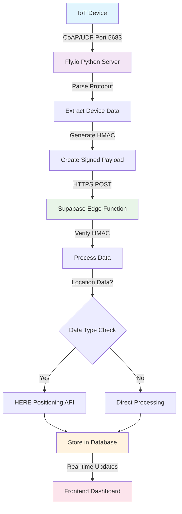

# IoT Data Flow Guide

## Overview

This guide explains how data flows from IoT devices through Fly.io to Supabase, what information devices need, and how to monitor the entire pipeline.

## Complete Data Flow



## Device Configuration Requirements

### What Your IoT Device Needs to Know

**Essential Information:**
- **Server Address**: `your-app.fly.dev` (replace with your actual Fly.io app name)
- **Port**: `5683` (CoAP standard port)
- **Protocol**: `CoAP/UDP`
- **Endpoint**: `/uplink`
- **Device ID**: Unique identifier (e.g., `soil_sensor_001`, `tracker_042`)
- **Data Format**: Protobuf using your `uplink_pb2` schema

**Example Device Configuration:**
```
CoAP Server: my-iot-server.fly.dev
Port: 5683
Protocol: UDP
Endpoint: /uplink
Device ID: soil_sensor_001
Message Format: Protobuf (uplink.proto)
```

### Device Data Structure

Your devices send protobuf messages with this structure:

```protobuf
message Uplink {
  uint32 uplink_count = 1;
  
  // Device heartbeat with configuration and status
  Heartbeat heartbeat = 2;
  
  // Location data (WiFi/Cell/GNSS)
  Location location = 3;
}

message Heartbeat {
  DeviceConfig config = 1;
  Activity activity = 2;
  Reboot reboot = 3;
  int32 modem_temperature = 4;
}
```

### Sample Device Payloads

**1. Soil Sensor Data:**
```json
{
  "devid": "soil_sensor_001",
  "uplink_count": 123,
  "temperature": 23.5,
  "soil_humidity": 65.2,
  "ph_level": 6.8,
  "nitrogen_level": 45,
  "phosphorus_level": 12,
  "potassium_level": 38
}
```

**2. Location Tracker:**
```json
{
  "devid": "tracker_001",
  "uplink_count": 456,
  "wifi": [
    {"mac": "AA:BB:CC:DD:EE:FF", "rssi": -45},
    {"mac": "11:22:33:44:55:66", "rssi": -67}
  ],
  "cells": [
    {"mcc": 310, "mnc": 410, "lac": 12345, "cid": 67890, "rssi": -78}
  ],
  "gnss": {
    "latitude": 37.7749,
    "longitude": -122.4194,
    "accuracy": 10
  }
}
```

## Data Processing Pipeline

### Step 1: Device Transmission
- Device collects sensor readings
- Packages data in protobuf format
- Sends CoAP message to Fly.io server
- Uses UDP for efficiency (low power consumption)

### Step 2: Fly.io Processing
```python
# Python server receives and processes
async def render_post(self, request):
    # Parse protobuf payload
    uplink = uplink_pb2.Uplink()
    uplink.ParseFromString(request.payload)
    
    # Extract different data types
    extract_device_config(uplink)
    extract_sensor_data(uplink)
    extract_location_data(uplink)
    
    # Forward to Supabase with HMAC signature
    await store_uplink_to_supabase(processed_data)
```

### Step 3: HMAC Security
```python
# Generate secure signature
import hmac
import hashlib

def generate_hmac(secret, payload):
    signature = hmac.new(
        secret.encode(),
        json.dumps(payload).encode(),
        hashlib.sha256
    ).hexdigest()
    return f"sha256={signature}"
```

### Step 4: Supabase Edge Function
```javascript
// Verify signature and process data
const signature = request.headers.get('X-Signature')
const isValid = await verifyHMAC(signature, body, secret)

if (isValid) {
    // Process location data via HERE API
    // Store sensor data in database
    // Return success response
}
```

### Step 5: Database Storage
Data is stored in structured tables:

**sensor_data table:**
```sql
INSERT INTO sensor_data (devid, data_type, data, uplink_count)
VALUES (
  'soil_sensor_001',
  'soil_data',
  '{"temperature": 23.5, "humidity": 65.2, "ph": 6.8}',
  123
);
```

**device_config table:**
```sql
UPDATE device_config 
SET 
  last_seen = now(),
  last_uplink_count = 123,
  temperature = 23.5
WHERE devid = 'soil_sensor_001';
```

## Monitoring Data Flow

### 1. Device Level Monitoring
**Check if device is sending data:**
- Monitor device logs/status LEDs
- Verify network connectivity
- Check CoAP message format

### 2. Fly.io Server Monitoring
```bash
# View real-time logs
flyctl logs -a your-app

# Look for these log patterns:
# ✅ Success: "Received payload: a1b2c3..."
# ✅ Success: "Parsed DeviceConfig: devid: soil_001"
# ✅ Success: "Successfully stored to Supabase"
# ❌ Error: "Failed to parse or handle uplink"
```

**Common Log Messages:**
```
[INFO] - Received payload: 0a04736f696c001268...
[INFO] - Parsed DeviceConfig: devid: "soil_001" temperature: 23.5
[INFO] - Successfully stored to Supabase
[WARNING] - No location data in uplink
[ERROR] - Failed to connect to Supabase: Connection timeout
```

### 3. Supabase Edge Function Monitoring
Check Edge Function logs in Supabase dashboard:
```
✅ "HMAC signature verified successfully"
✅ "Stored sensor_data: soil_data for device soil_001"
✅ "HERE API returned location: 37.7749, -122.4194"
❌ "HMAC signature verification failed"
❌ "Missing required field: devid"
```

### 4. Database Monitoring
```sql
-- Check latest sensor data
SELECT devid, data_type, data, created_at 
FROM sensor_data 
ORDER BY created_at DESC 
LIMIT 10;

-- Check device status
SELECT devid, last_seen, last_uplink_count, temperature
FROM device_config 
ORDER BY last_seen DESC;

-- Monitor data frequency
SELECT 
  devid, 
  COUNT(*) as message_count,
  MAX(created_at) as latest_message
FROM sensor_data 
WHERE created_at > NOW() - INTERVAL '1 hour'
GROUP BY devid;
```

### 5. Frontend Real-time Updates
```javascript
// Subscribe to real-time updates
const subscription = supabase
  .channel('sensor-updates')
  .on('postgres_changes', {
    event: 'INSERT',
    schema: 'public',
    table: 'sensor_data'
  }, (payload) => {
    console.log('New sensor data:', payload.new)
    updateDashboard(payload.new)
  })
  .subscribe()
```

## Data Types & Formats

### Supported Sensor Types

**1. Location Data:**
```json
{
  "data_type": "location",
  "data": {
    "latitude": 37.7749,
    "longitude": -122.4194,
    "accuracy": 10,
    "source": "here"
  }
}
```

**2. Soil Sensors:**
```json
{
  "data_type": "soil_data",
  "data": {
    "temperature": 23.5,
    "humidity": 65.2,
    "ph": 6.8,
    "nitrogen": 45,
    "phosphorus": 12,
    "potassium": 38,
    "unit_temp": "celsius",
    "unit_humidity": "percent"
  }
}
```

**3. Environmental Sensors:**
```json
{
  "data_type": "environmental",
  "data": {
    "air_temperature": 22.1,
    "air_humidity": 60.5,
    "pressure": 1013.25,
    "light_level": 450
  }
}
```

**4. Device Status:**
```json
{
  "data_type": "device_status",
  "data": {
    "battery_level": 85,
    "signal_strength": -67,
    "uptime_hours": 72,
    "firmware_version": "1.2.3"
  }
}
```

## Troubleshooting Data Flow

### Device Not Sending Data
1. **Check Network Connectivity**
   - Verify device can reach internet
   - Test DNS resolution: `nslookup your-app.fly.dev`
   - Check firewall rules for UDP port 5683

2. **Verify CoAP Configuration**
   - Server: `your-app.fly.dev`
   - Port: `5683`
   - Protocol: `UDP`
   - Endpoint: `/uplink`

### Data Not Reaching Supabase
1. **Check Fly.io Logs**
   ```bash
   flyctl logs -a your-app | grep ERROR
   ```

2. **Verify HMAC Secret**
   ```bash
   flyctl secrets list -a your-app
   # Should show FLY_INGEST_SECRET
   ```

3. **Test Edge Function**
   ```bash
   curl -X POST https://cdwtsrzshpotkfbyyyjk.supabase.co/functions/v1/ingest-sensor-data \
     -H "Content-Type: application/json" \
     -H "X-Signature: sha256=test" \
     -d '{"devid":"test","test":true}'
   ```

### Database Issues
1. **Check RLS Policies**
   - Ensure authenticated users can read sensor_data
   - Verify admin/moderator roles can insert data

2. **Monitor Database Logs**
   ```sql
   -- Check for database errors
   SELECT error_severity, event_message, timestamp
   FROM postgres_logs
   WHERE error_severity IN ('ERROR', 'FATAL')
   ORDER BY timestamp DESC
   LIMIT 10;
   ```

## Performance Optimization

### Device Optimization
- Send data in batches when possible
- Use appropriate heartbeat intervals
- Implement exponential backoff for retries
- Compress protobuf messages

### Server Optimization
- Use async processing in Python server
- Batch database operations
- Implement connection pooling
- Monitor memory usage

### Database Optimization
- Index frequently queried columns
- Partition large tables by date
- Use appropriate data types
- Regular VACUUM and ANALYZE