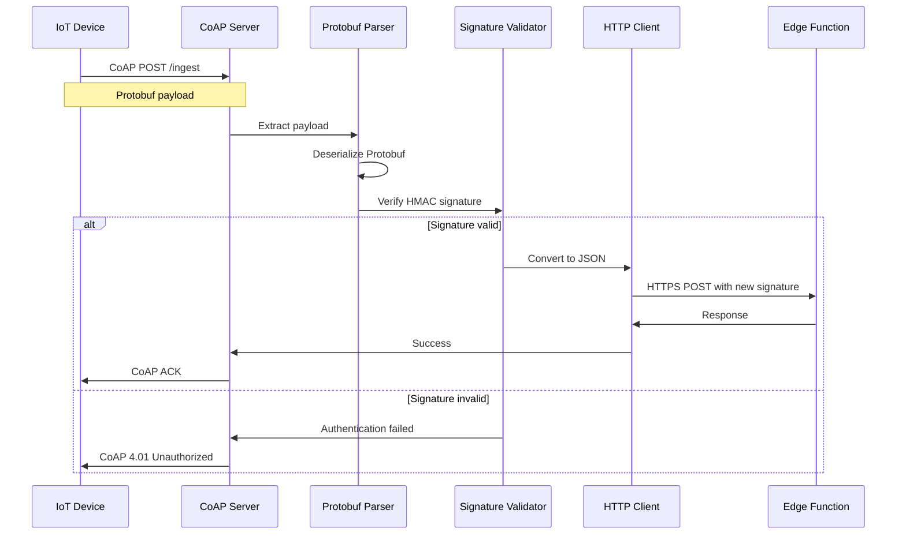

# Fly.io CoAP Interface Specification

## Overview

The Fly.io Python server provides a CoAP-to-HTTPS bridge for IoT devices. It receives CoAP messages over UDP, processes Protobuf payloads, and forwards data to Supabase Edge Functions with HMAC authentication.

**Server Address**: `your-app.fly.dev`  
**Protocol**: CoAP over UDP  
**Port**: 5683  
**Endpoint**: `/ingest`

## CoAP Configuration

### Connection Parameters
- **Protocol**: CoAP (RFC 7252)
- **Transport**: UDP
- **Port**: 5683 (standard CoAP port)
- **Message Type**: Confirmable (CON)
- **Content Format**: Application/Protobuf (ID: 42)

### CoAP Options
- **Uri-Path**: `ingest`
- **Content-Format**: `42` (Application/Protobuf)
- **Max-Age**: `60` (seconds)

## Device Authentication

### HMAC Signature (Device-Side)
Devices must calculate HMAC-SHA256 signatures of their Protobuf payload:

```python
import hmac
import hashlib

def calculate_device_signature(secret_key: str, protobuf_data: bytes) -> str:
    signature = hmac.new(
        secret_key.encode('utf-8'),
        protobuf_data,
        hashlib.sha256
    ).hexdigest()
    return signature
```

### CoAP Message Structure

```
CoAP Header (4 bytes)
├── Version: 1
├── Type: CON (0)
├── Token Length: 4
├── Code: POST (0.02)
├── Message ID: <random>
└── Token: <4-byte random>

CoAP Options
├── Uri-Path: "ingest"
└── Content-Format: 42

Payload
└── Protobuf serialized data
```

## Protobuf Schema

### Main Message Definition

```protobuf
syntax = "proto3";

message Uplink {
  string devid = 1;
  uint32 uplink_count = 2;
  oneof payload {
    Heartbeat heartbeat = 3;
    Location location = 4;
    SensorData sensor_data = 5;
  }
  string signature = 6;  // HMAC signature
}

message Heartbeat {
  int64 timestamp = 1;
  uint32 battery_level = 2;
  int32 signal_strength = 3;
}

message Location {
  GNSS gnss = 1;
  repeated WiFiScan wifi = 2;
  repeated CellularScan cells = 3;
  int64 timestamp = 4;
}

message GNSS {
  double latitude = 1;
  double longitude = 2;
  float accuracy = 3;
  int64 timestamp = 4;
}

message WiFiScan {
  string bssid = 1;
  int32 rssi = 2;
  uint32 channel = 3;
  string ssid = 4;  // Optional
}

message CellularScan {
  uint32 mcc = 1;  // Mobile Country Code
  uint32 mnc = 2;  // Mobile Network Code
  uint32 lac = 3;  // Location Area Code
  uint32 cid = 4;  // Cell ID
  int32 rssi = 5;
}

message SensorData {
  float temperature = 1;
  float humidity = 2;
  float soil_moisture = 3;
  uint32 battery_level = 4;
  int64 timestamp = 5;
}
```

### Example Protobuf Generation

```python
import uplink_pb2  # Generated from .proto file
import time

# Create location message
location = uplink_pb2.Location()
location.gnss.latitude = 37.7749
location.gnss.longitude = -122.4194
location.gnss.accuracy = 5.0
location.gnss.timestamp = int(time.time())

# Add Wi-Fi scan data
wifi = location.wifi.add()
wifi.bssid = "aa:bb:cc:dd:ee:ff"
wifi.rssi = -45
wifi.channel = 6

# Create main uplink message
uplink = uplink_pb2.Uplink()
uplink.devid = "device_001"
uplink.uplink_count = 42
uplink.location.CopyFrom(location)

# Calculate signature
protobuf_data = uplink.SerializeToString()
uplink.signature = calculate_device_signature("your-secret-key", protobuf_data)

# Final serialization
final_data = uplink.SerializeToString()
```

## CoAP Client Implementation

### Python Example (using aiocoap)

```python
import asyncio
from aiocoap import *
import uplink_pb2

async def send_coap_message():
    # Create CoAP context
    context = await Context.create_client_context()
    
    # Prepare Protobuf payload
    uplink = uplink_pb2.Uplink()
    uplink.devid = "device_001"
    uplink.uplink_count = 42
    
    # Add location data
    uplink.location.gnss.latitude = 37.7749
    uplink.location.gnss.longitude = -122.4194
    uplink.location.gnss.accuracy = 5.0
    
    # Serialize and sign
    protobuf_data = uplink.SerializeToString()
    uplink.signature = calculate_device_signature("secret", protobuf_data)
    final_payload = uplink.SerializeToString()
    
    # Create CoAP request
    request = Message(
        code=POST,
        payload=final_payload,
        uri="coap://your-app.fly.dev:5683/ingest"
    )
    request.opt.content_format = 42  # Application/Protobuf
    
    try:
        response = await context.request(request).response
        print(f"Response: {response.code}")
        print(f"Payload: {response.payload}")
    except Exception as e:
        print(f"Error: {e}")

# Run the client
asyncio.run(send_coap_message())
```

### C++ Example (using libcoap)

```cpp
#include <coap2/coap.h>
#include "uplink.pb.h"

void send_coap_request() {
    coap_context_t *ctx;
    coap_session_t *session;
    coap_pdu_t *pdu;
    coap_address_t dst;
    
    // Initialize CoAP context
    ctx = coap_new_context(nullptr);
    
    // Set server address
    coap_address_init(&dst);
    dst.addr.sin.sin_family = AF_INET;
    dst.addr.sin.sin_port = htons(5683);
    inet_pton(AF_INET, "your-app.fly.dev", &dst.addr.sin.sin_addr);
    
    // Create session
    session = coap_new_client_session(ctx, nullptr, &dst, COAP_PROTO_UDP);
    
    // Create Protobuf message
    Uplink uplink;
    uplink.set_devid("device_001");
    uplink.set_uplink_count(42);
    
    auto* location = uplink.mutable_location();
    auto* gnss = location->mutable_gnss();
    gnss->set_latitude(37.7749);
    gnss->set_longitude(-122.4194);
    gnss->set_accuracy(5.0);
    
    // Serialize to string
    std::string serialized;
    uplink.SerializeToString(&serialized);
    
    // Create CoAP PDU
    pdu = coap_pdu_init(COAP_MESSAGE_CON, COAP_REQUEST_POST, 0, 1024);
    
    // Add URI path
    coap_add_option(pdu, COAP_OPTION_URI_PATH, 6, 
                   reinterpret_cast<const uint8_t*>("ingest"));
    
    // Add content format (Protobuf)
    uint8_t content_format = 42;
    coap_add_option(pdu, COAP_OPTION_CONTENT_FORMAT, 1, &content_format);
    
    // Add payload
    coap_add_data(pdu, serialized.length(), 
                  reinterpret_cast<const uint8_t*>(serialized.c_str()));
    
    // Send request
    coap_send(session, pdu);
    
    // Cleanup
    coap_session_release(session);
    coap_free_context(ctx);
}
```

## Server Processing

### Message Flow



### Python Server Logic

```python
import aiocoap
import asyncio
import json
import hmac
import hashlib
import uplink_pb2
from aiocoap import resource

class IngestResource(resource.Resource):
    async def render_post(self, request):
        try:
            # Parse Protobuf payload
            uplink = uplink_pb2.Uplink()
            uplink.ParseFromString(request.payload)
            
            # Verify device signature
            if not self.verify_signature(uplink):
                return aiocoap.Message(code=aiocoap.UNAUTHORIZED)
            
            # Convert to JSON
            json_payload = self.protobuf_to_json(uplink)
            
            # Forward to Edge Function
            response = await self.forward_to_edge_function(json_payload)
            
            if response.get('success'):
                return aiocoap.Message(code=aiocoap.CHANGED)
            else:
                return aiocoap.Message(code=aiocoap.INTERNAL_SERVER_ERROR)
                
        except Exception as e:
            logger.error(f"Processing error: {e}")
            return aiocoap.Message(code=aiocoap.BAD_REQUEST)
    
    def verify_signature(self, uplink):
        # Extract signature and create unsigned message
        signature = uplink.signature
        uplink.signature = ""
        
        # Calculate expected signature
        unsigned_data = uplink.SerializeToString()
        expected = hmac.new(
            self.device_secret.encode(),
            unsigned_data,
            hashlib.sha256
        ).hexdigest()
        
        return hmac.compare_digest(signature, expected)
```

## Network Configuration

### Fly.io Service Configuration

```toml
# fly.toml
[[services]]
  protocol = "udp"
  internal_port = 5683
  
  [[services.ports]]
    port = 5683

[[services]]
  protocol = "tcp"
  internal_port = 8080
  
  [[services.ports]]
    port = 80
    handlers = ["http"]
  
  [[services.ports]]
    port = 443
    handlers = ["http", "tls"]
```

### Firewall & Security
- **Allowed Ports**: 5683 (CoAP), 80/443 (HTTP/HTTPS)
- **Rate Limiting**: 1000 CoAP messages per minute per IP
- **DDoS Protection**: Automatic by Fly.io infrastructure
- **Geographic Filtering**: Optional IP geolocation filtering

## Error Handling

### CoAP Response Codes

| Code | Name | Description |
|------|------|-------------|
| 2.04 | Changed | Message processed successfully |
| 4.00 | Bad Request | Invalid Protobuf format |
| 4.01 | Unauthorized | HMAC signature verification failed |
| 4.15 | Unsupported Content-Format | Not application/protobuf |
| 5.00 | Internal Server Error | Server processing error |
| 5.03 | Service Unavailable | Downstream service unavailable |

### Device Retry Logic
Devices should implement exponential backoff:

```python
async def send_with_retry(message, max_retries=3):
    for attempt in range(max_retries):
        try:
            response = await send_coap_message(message)
            if response.code.is_successful():
                return response
        except Exception as e:
            wait_time = (2 ** attempt) * 1.0  # 1, 2, 4 seconds
            await asyncio.sleep(wait_time)
    
    raise Exception("Max retries exceeded")
```

## Performance Characteristics

### Throughput
- **Maximum Concurrent**: 1000 CoAP connections
- **Messages per Second**: 500 sustained, 1000 burst
- **Payload Size Limit**: 1KB per message
- **Processing Latency**: < 100ms average

### Resource Usage
- **Memory**: ~50MB base + 1KB per connection
- **CPU**: 0.1 vCPU per 100 messages/second
- **Network**: ~100 bytes overhead per message

### Monitoring Metrics
- **CoAP Message Rate**: Messages per second
- **Error Rate**: Failed/total message ratio
- **Processing Time**: P50, P95, P99 latencies
- **Connection Count**: Active CoAP sessions