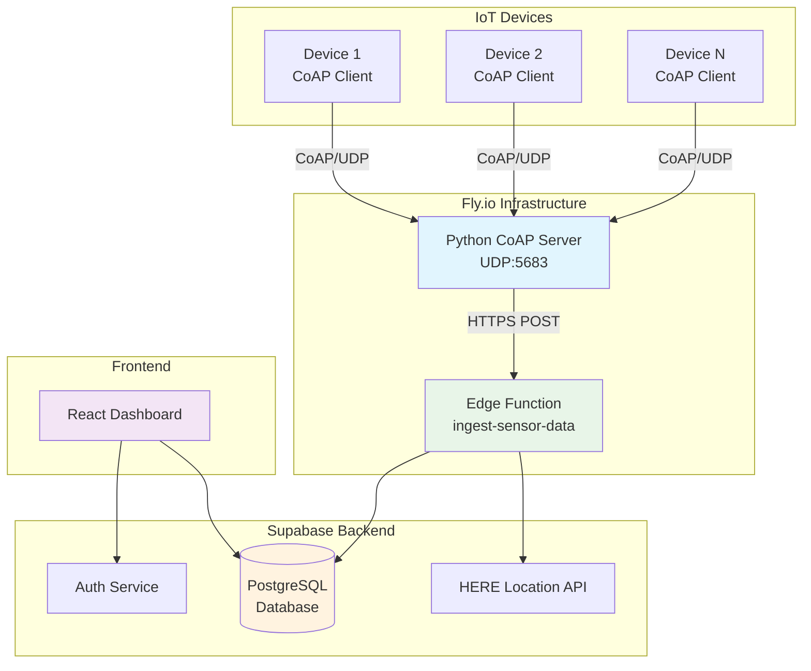
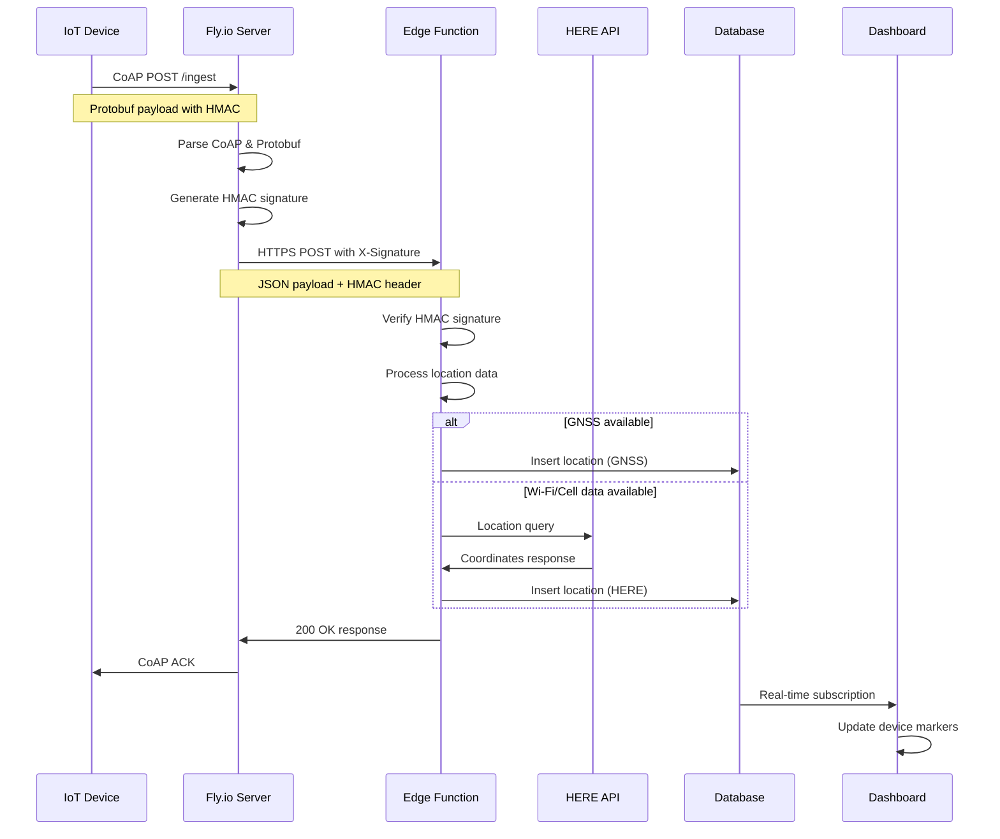

# System Architecture Overview

## Architecture Diagram

## Component Overview

### IoT Devices
- **Protocol**: CoAP over UDP
- **Port**: 5683
- **Authentication**: HMAC-SHA256 signatures
- **Data Format**: Protobuf serialization
- **Capabilities**:
  - GNSS positioning
  - Wi-Fi scanning
  - Cellular tower detection
  - Sensor data collection

### Fly.io Ingestion Layer
- **Runtime**: Python 3.11+ with aiocoap
- **Scaling**: Auto-scaling based on load
- **Security**: HMAC signature generation and forwarding
- **Processing**:
  - CoAP message parsing
  - Protobuf deserialization
  - HTTPS relay to Supabase

### Supabase Backend
- **Edge Functions**: Deno runtime for data processing
- **Database**: PostgreSQL with Row Level Security
- **Authentication**: JWT tokens with role-based access
- **External APIs**: HERE Location Services integration

### Frontend Dashboard
- **Framework**: React with TypeScript
- **UI Library**: Tailwind CSS with shadcn/ui
- **Mapping**: Leaflet with clustering
- **Real-time**: Supabase subscriptions

## Data Flow Sequence

## Technology Stack

| Layer | Technology | Purpose |
|-------|------------|---------|
| **Devices** | CoAP/UDP, Protobuf | Efficient IoT communication |
| **Ingestion** | Python, aiocoap, Fly.io | Protocol translation & scaling |
| **Processing** | Deno, TypeScript, Supabase | Serverless data processing |
| **Storage** | PostgreSQL, RLS | Secure data persistence |
| **API** | HERE Location Services | Location resolution |
| **Frontend** | React, TypeScript, Tailwind | User interface |
| **Mapping** | Leaflet.js | Interactive maps |

## Scalability Considerations

### Horizontal Scaling
- **Fly.io**: Auto-scaling based on CoAP request volume
- **Supabase**: Managed PostgreSQL with connection pooling
- **Edge Functions**: Automatic scaling per request

### Performance Optimizations
- **Connection Pooling**: PostgreSQL connections managed by Supabase
- **Caching**: Edge Function responses cached where appropriate
- **Clustering**: Map markers clustered for performance
- **Real-time**: Efficient WebSocket subscriptions

### Resource Management
- **Memory**: Python server optimized for low memory usage
- **CPU**: Asynchronous processing in all layers
- **Network**: CoAP chosen for minimal bandwidth usage
- **Storage**: Database indexes on frequently queried columns

## Security Architecture

### Authentication & Authorization
- **Device Level**: HMAC-SHA256 with shared secrets
- **API Level**: JWT tokens with role verification
- **Database Level**: Row Level Security policies
- **Network Level**: HTTPS/TLS encryption

### Data Protection
- **In Transit**: TLS 1.3 for all HTTPS communications
- **At Rest**: Supabase managed encryption
- **Processing**: Signature verification at every layer
- **Access Control**: Role-based permissions (admin/manager/user)

## Monitoring & Observability

### Application Metrics
- **Device Health**: Last seen timestamps and heartbeats
- **Ingestion Rate**: CoAP messages per second
- **Processing Time**: Edge function execution duration
- **Error Rates**: Failed requests and retries

### Infrastructure Metrics
- **Fly.io**: CPU, memory, and network utilization
- **Supabase**: Database performance and connection counts
- **HERE API**: Request quotas and response times

### Alerting
- **Device Offline**: No data received within threshold
- **High Error Rate**: Processing failures above 5%
- **API Limits**: Approaching HERE API quotas
- **System Health**: Infrastructure component failures