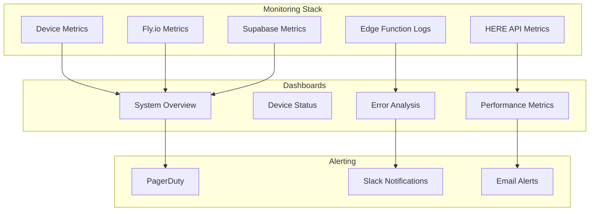

# Monitoring & Observability

## Overview

This document outlines the monitoring strategy, metrics collection, alerting, and observability practices for the IoT Device Management System.

## Architecture Monitoring

### System Health Dashboard



## Key Metrics

### Device-Level Metrics

#### Device Health
```sql
-- Active devices (last 24 hours)
SELECT COUNT(DISTINCT devid) as active_devices
FROM sensor_data 
WHERE timestamp > NOW() - INTERVAL '24 hours';

-- Device uptime percentage
SELECT 
    devid,
    COUNT(*) as total_reports,
    COUNT(*) * 100.0 / (24 * 60 / 15) as uptime_percentage  -- Assuming 15min intervals
FROM sensor_data 
WHERE timestamp > NOW() - INTERVAL '24 hours'
GROUP BY devid;

-- Battery levels
SELECT 
    devid,
    AVG(CAST(data->>'battery_level' AS FLOAT)) as avg_battery
FROM sensor_data 
WHERE timestamp > NOW() - INTERVAL '1 hour'
  AND data ? 'battery_level'
GROUP BY devid
ORDER BY avg_battery ASC;
```

#### Data Quality
```sql
-- Location accuracy distribution
SELECT 
    CASE 
        WHEN CAST(data->>'accuracy' AS FLOAT) < 10 THEN 'High (<10m)'
        WHEN CAST(data->>'accuracy' AS FLOAT) < 50 THEN 'Medium (10-50m)'
        ELSE 'Low (>50m)'
    END as accuracy_tier,
    COUNT(*) as count
FROM sensor_data 
WHERE data_type = 'location'
  AND timestamp > NOW() - INTERVAL '24 hours'
GROUP BY accuracy_tier;

-- Data ingestion rate
SELECT 
    DATE_TRUNC('hour', timestamp) as hour,
    COUNT(*) as message_count,
    COUNT(DISTINCT devid) as unique_devices
FROM sensor_data 
WHERE timestamp > NOW() - INTERVAL '24 hours'
GROUP BY hour
ORDER BY hour;
```

### Infrastructure Metrics

#### Fly.io Monitoring
```bash
# CPU and Memory usage
flyctl metrics --app your-coap-server

# Request metrics
flyctl logs --app your-coap-server | grep "REQUEST"

# Error rate monitoring
flyctl logs --app your-coap-server | grep "ERROR" | wc -l
```

#### Supabase Metrics
```sql
-- Database performance
SELECT 
    schemaname,
    tablename,
    n_tup_ins + n_tup_upd + n_tup_del as total_operations,
    n_tup_ins as inserts,
    n_tup_upd as updates,
    n_tup_del as deletes,
    seq_scan,
    idx_scan
FROM pg_stat_user_tables 
ORDER BY total_operations DESC;

-- Connection count
SELECT count(*) as active_connections
FROM pg_stat_activity 
WHERE state = 'active';

-- Slow queries
SELECT 
    query,
    mean_exec_time,
    calls,
    total_exec_time
FROM pg_stat_statements 
WHERE mean_exec_time > 100  -- queries taking > 100ms
ORDER BY mean_exec_time DESC
LIMIT 10;
```

### API Performance Metrics

#### Edge Function Performance
```javascript
// Add to Edge Function for metrics collection
const startTime = Date.now();

// ... processing logic ...

const processingTime = Date.now() - startTime;
console.log(JSON.stringify({
  metric: 'processing_time',
  value: processingTime,
  devid: payload.devid,
  timestamp: new Date().toISOString()
}));
```

#### HERE API Usage
```javascript
// Track HERE API calls
const hereApiMetrics = {
  requests_total: 0,
  requests_success: 0,
  requests_error: 0,
  response_time_ms: [],
  quota_remaining: 0
};

async function callHereApi(data) {
  const startTime = Date.now();
  hereApiMetrics.requests_total++;
  
  try {
    const response = await fetch(HERE_API_URL, {
      method: 'POST',
      body: JSON.stringify(data)
    });
    
    const responseTime = Date.now() - startTime;
    hereApiMetrics.response_time_ms.push(responseTime);
    
    if (response.ok) {
      hereApiMetrics.requests_success++;
      hereApiMetrics.quota_remaining = response.headers.get('X-RateLimit-Remaining');
    } else {
      hereApiMetrics.requests_error++;
    }
    
    return response;
  } catch (error) {
    hereApiMetrics.requests_error++;
    throw error;
  }
}
```

## Dashboard Configuration

### System Overview Dashboard

#### Key Performance Indicators (KPIs)
- **System Uptime**: 99.9% target
- **Active Devices**: Current count vs. expected
- **Data Ingestion Rate**: Messages per minute
- **Error Rate**: < 1% target
- **Average Response Time**: < 500ms target

#### Metrics Queries
```sql
-- System uptime (last 24 hours)
WITH hourly_status AS (
  SELECT 
    DATE_TRUNC('hour', timestamp) as hour,
    COUNT(*) > 0 as system_active
  FROM sensor_data 
  WHERE timestamp > NOW() - INTERVAL '24 hours'
  GROUP BY hour
)
SELECT 
  COUNT(CASE WHEN system_active THEN 1 END) * 100.0 / COUNT(*) as uptime_percentage
FROM hourly_status;

-- Error rate calculation
WITH error_count AS (
  SELECT COUNT(*) as errors
  FROM logs 
  WHERE level = 'ERROR' 
    AND timestamp > NOW() - INTERVAL '1 hour'
),
total_count AS (
  SELECT COUNT(*) as total
  FROM sensor_data 
  WHERE timestamp > NOW() - INTERVAL '1 hour'
)
SELECT 
  errors * 100.0 / NULLIF(total, 0) as error_rate_percentage
FROM error_count, total_count;
```

### Device Status Dashboard

#### Device Grid View
```sql
-- Device status summary
SELECT 
    devid,
    MAX(timestamp) as last_seen,
    EXTRACT(EPOCH FROM (NOW() - MAX(timestamp))) / 60 as minutes_offline,
    COUNT(*) as messages_last_hour,
    AVG(CAST(data->>'battery_level' AS FLOAT)) as avg_battery,
    CASE 
        WHEN MAX(timestamp) > NOW() - INTERVAL '30 minutes' THEN 'online'
        WHEN MAX(timestamp) > NOW() - INTERVAL '2 hours' THEN 'warning'
        ELSE 'offline'
    END as status
FROM sensor_data 
WHERE timestamp > NOW() - INTERVAL '1 hour'
GROUP BY devid
ORDER BY last_seen DESC;
```

#### Location Accuracy Heatmap
```sql
-- Location accuracy by device and time
SELECT 
    devid,
    DATE_TRUNC('hour', timestamp) as hour,
    AVG(CAST(data->>'accuracy' AS FLOAT)) as avg_accuracy,
    COUNT(*) as location_reports
FROM sensor_data 
WHERE data_type = 'location'
  AND timestamp > NOW() - INTERVAL '24 hours'
  AND data ? 'accuracy'
GROUP BY devid, hour
ORDER BY devid, hour;
```

## Alerting Configuration

### Critical Alerts (PagerDuty)

#### System Down Alert
```sql
-- Alert if no data received in 15 minutes
SELECT 'CRITICAL: No device data received' as alert
WHERE NOT EXISTS (
  SELECT 1 FROM sensor_data 
  WHERE timestamp > NOW() - INTERVAL '15 minutes'
);
```

#### High Error Rate Alert
```sql
-- Alert if error rate > 5% in last 10 minutes
WITH recent_errors AS (
  SELECT COUNT(*) as error_count
  FROM logs 
  WHERE level = 'ERROR' 
    AND timestamp > NOW() - INTERVAL '10 minutes'
),
recent_total AS (
  SELECT COUNT(*) as total_count
  FROM sensor_data 
  WHERE timestamp > NOW() - INTERVAL '10 minutes'
)
SELECT 'CRITICAL: High error rate' as alert
FROM recent_errors, recent_total
WHERE error_count * 100.0 / NULLIF(total_count, 0) > 5;
```

### Warning Alerts (Slack)

#### Device Offline Alert
```sql
-- Alert if device offline > 2 hours
SELECT 
    CONCAT('WARNING: Device ', devid, ' offline for ', 
           ROUND(EXTRACT(EPOCH FROM (NOW() - MAX(timestamp))) / 3600, 1), ' hours') as alert,
    devid
FROM sensor_data 
GROUP BY devid
HAVING MAX(timestamp) < NOW() - INTERVAL '2 hours'
  AND MAX(timestamp) > NOW() - INTERVAL '24 hours';  -- Only alert for recently active devices
```

#### Low Battery Alert
```sql
-- Alert if device battery < 20%
SELECT 
    CONCAT('WARNING: Device ', devid, ' battery at ', 
           ROUND(AVG(CAST(data->>'battery_level' AS FLOAT)), 1), '%') as alert,
    devid
FROM sensor_data 
WHERE timestamp > NOW() - INTERVAL '30 minutes'
  AND data ? 'battery_level'
GROUP BY devid
HAVING AVG(CAST(data->>'battery_level' AS FLOAT)) < 20;
```

### Information Alerts (Email)

#### Daily Summary
```sql
-- Daily system summary
SELECT 
    'Daily Summary' as alert_type,
    COUNT(DISTINCT devid) as active_devices,
    COUNT(*) as total_messages,
    AVG(EXTRACT(EPOCH FROM (NOW() - timestamp))) / 60 as avg_delay_minutes,
    COUNT(CASE WHEN data_type = 'location' THEN 1 END) as location_updates
FROM sensor_data 
WHERE timestamp > NOW() - INTERVAL '24 hours';
```

## Log Management

### Structured Logging

#### Edge Function Logging
```javascript
// Structured log entry
function logMetric(level, message, metadata = {}) {
  const logEntry = {
    timestamp: new Date().toISOString(),
    level: level,
    message: message,
    service: 'ingest-sensor-data',
    ...metadata
  };
  
  console.log(JSON.stringify(logEntry));
}

// Usage examples
logMetric('INFO', 'Device data processed', {
  devid: 'device_001',
  processing_time_ms: 150,
  location_source: 'gnss'
});

logMetric('ERROR', 'HMAC verification failed', {
  devid: 'device_002',
  error_code: 'INVALID_SIGNATURE'
});
```

#### Fly.io Server Logging
```python
import logging
import json
from datetime import datetime

# Configure structured logging
logging.basicConfig(
    level=logging.INFO,
    format='%(message)s'
)

logger = logging.getLogger(__name__)

def log_structured(level, message, **kwargs):
    log_entry = {
        'timestamp': datetime.utcnow().isoformat(),
        'level': level,
        'message': message,
        'service': 'coap-server',
        **kwargs
    }
    logger.log(getattr(logging, level), json.dumps(log_entry))

# Usage
log_structured('INFO', 'CoAP message received', 
               devid='device_001', 
               payload_size=256)
```

### Log Aggregation

#### Query Examples
```bash
# Fly.io logs filtering
flyctl logs --app your-coap-server | grep "ERROR"
flyctl logs --app your-coap-server --since 1h | grep "device_001"

# Supabase function logs
supabase functions logs --filter edge-function-name | grep "WARN"
```

#### Log Retention Policy
- **Edge Function Logs**: 7 days (Supabase default)
- **Fly.io Logs**: 30 days 
- **Database Logs**: 90 days
- **Critical Events**: Exported to long-term storage

## Performance Monitoring

### Response Time Tracking

#### Percentile Analysis
```sql
-- Response time percentiles (if tracking in database)
SELECT 
    PERCENTILE_CONT(0.5) WITHIN GROUP (ORDER BY processing_time_ms) as p50,
    PERCENTILE_CONT(0.95) WITHIN GROUP (ORDER BY processing_time_ms) as p95,
    PERCENTILE_CONT(0.99) WITHIN GROUP (ORDER BY processing_time_ms) as p99,
    AVG(processing_time_ms) as avg_response_time
FROM performance_logs 
WHERE timestamp > NOW() - INTERVAL '1 hour';
```

### Capacity Planning

#### Growth Metrics
```sql
-- Device growth rate
SELECT 
    DATE(timestamp) as date,
    COUNT(DISTINCT previous.devid) as devices_yesterday,
    COUNT(DISTINCT current.devid) as devices_today,
    COUNT(DISTINCT current.devid) - COUNT(DISTINCT previous.devid) as net_growth
FROM sensor_data current
LEFT JOIN sensor_data previous ON previous.timestamp BETWEEN 
    current.timestamp - INTERVAL '2 days' AND 
    current.timestamp - INTERVAL '1 day'
WHERE current.timestamp > NOW() - INTERVAL '7 days'
GROUP BY DATE(current.timestamp)
ORDER BY date;

-- Message volume trends
SELECT 
    DATE_TRUNC('hour', timestamp) as hour,
    COUNT(*) as message_count,
    COUNT(*) / 3600.0 as messages_per_second
FROM sensor_data 
WHERE timestamp > NOW() - INTERVAL '7 days'
GROUP BY hour
ORDER BY hour;
```

## Incident Response

### Runbook Integration

#### Incident Detection
```bash
#!/bin/bash
# monitoring-check.sh

# Check system health
RECENT_DATA=$(psql -t -c "SELECT COUNT(*) FROM sensor_data WHERE timestamp > NOW() - INTERVAL '15 minutes'")

if [ "$RECENT_DATA" -eq 0 ]; then
    echo "CRITICAL: No recent data received"
    # Trigger PagerDuty alert
    curl -X POST https://events.pagerduty.com/v2/enqueue \
      -H "Content-Type: application/json" \
      -d '{"routing_key":"YOUR_KEY","event_action":"trigger","payload":{"summary":"IoT System Down","severity":"critical"}}'
fi
```

#### Automated Recovery
```bash
#!/bin/bash
# auto-recovery.sh

# Restart Fly.io app if needed
FLY_STATUS=$(flyctl status --json | jq -r '.Allocations[0].Status')
if [ "$FLY_STATUS" != "running" ]; then
    echo "Restarting Fly.io app"
    flyctl restart
fi

# Check Edge Function health
EDGE_STATUS=$(curl -s -o /dev/null -w "%{http_code}" https://cdwtsrzshpotkfbyyyjk.supabase.co/functions/v1/health)
if [ "$EDGE_STATUS" != "200" ]; then
    echo "Edge Function unhealthy, redeploying"
    supabase functions deploy ingest-sensor-data
fi
```

### Escalation Procedures

1. **Level 1 (Automated)**: Self-healing scripts, restart services
2. **Level 2 (On-call)**: Manual intervention, scaling adjustments
3. **Level 3 (Team)**: Architecture changes, external vendor issues
4. **Level 4 (Management)**: Business impact, security incidents

## Security Monitoring

### Threat Detection
```sql
-- Unusual device activity
SELECT 
    devid,
    COUNT(*) as message_count,
    COUNT(DISTINCT EXTRACT(HOUR FROM timestamp)) as active_hours
FROM sensor_data 
WHERE timestamp > NOW() - INTERVAL '24 hours'
GROUP BY devid
HAVING COUNT(*) > 1000  -- Threshold for unusual activity
ORDER BY message_count DESC;

-- Failed authentication attempts
SELECT 
    COUNT(*) as failed_attempts,
    DATE_TRUNC('hour', timestamp) as hour
FROM logs 
WHERE message LIKE '%HMAC verification failed%'
  AND timestamp > NOW() - INTERVAL '24 hours'
GROUP BY hour
HAVING COUNT(*) > 10  -- Threshold for potential attack
ORDER BY hour;
```

### Audit Trail
```sql
-- User activity audit
SELECT 
    user_id,
    action,
    resource,
    timestamp,
    ip_address
FROM audit_logs 
WHERE timestamp > NOW() - INTERVAL '24 hours'
ORDER BY timestamp DESC;
```