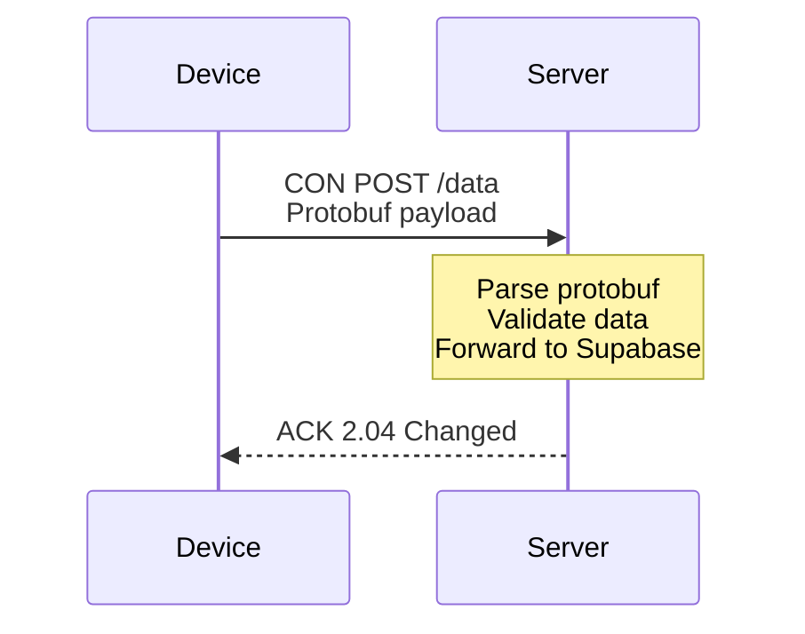
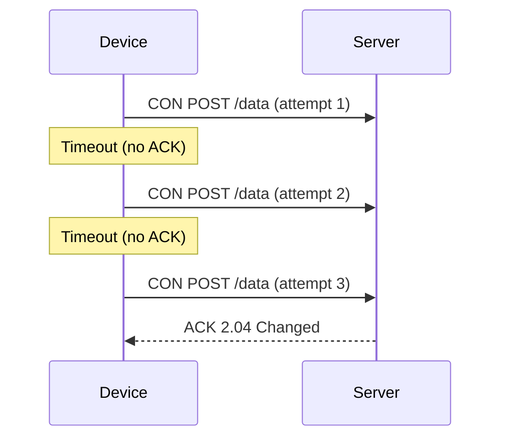
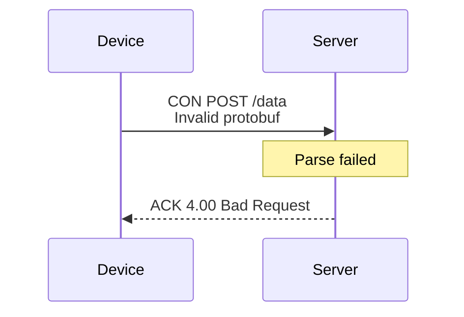

# CoAP Endpoints

CoAP (Constrained Application Protocol) endpoint specifications for device-to-server communication.

## Endpoint Configuration

**Production Server**:
- **Host**: `flyio-nbiot.fly.dev`
- **Port**: `5683` (UDP)
- **Protocol**: CoAP (RFC 7252)
- **Content-Type**: `application/octet-stream`

**Local Testing Server**:
- **Host**: `localhost`
- **Port**: `5683` (UDP)
- **Protocol**: CoAP

## Endpoints

### POST /data

Primary endpoint for device data ingestion.

**Method**: `POST`
**Path**: `/data`
**Content-Type**: `application/octet-stream` (Protocol Buffers)
**Message Type**: Confirmable (CON) - requires acknowledgment

#### Request

**Headers**:
- `Content-Format`: 42 (application/octet-stream)

**Payload**:
- Binary-encoded Protocol Buffer message (Uplink)
- See [Protocol Messages](/api-reference/protocol-messages) for structure

**Example CoAP Request**:
```
CON POST coap://flyio-nbiot.fly.dev:5683/data
Content-Format: 42
Message ID: 0x1234
Token: 0xAB

<binary protobuf payload>
```

#### Response

**Success Response** (2.04 Changed):
```
ACK 2.04 Changed
Message ID: 0x1234
Token: 0xAB

(empty payload or optional downlink data)
```

**Error Responses**:

| Code | Description | Meaning |
|------|-------------|---------|
| 4.00 | Bad Request | Invalid protobuf format |
| 4.15 | Unsupported Content-Format | Wrong content type |
| 5.00 | Internal Server Error | Server processing failed |
| 5.03 | Service Unavailable | Server overloaded or down |

#### Usage Example (Python)

```python
from aiocoap import *
import uplink_pb2

# Create CoAP message
uplink = uplink_pb2.Uplink()
uplink.uplink_count = 1
# ... populate message ...

# Serialize to binary
payload = uplink.SerializeToString()

# Send CoAP POST
protocol = await Context.create_client_context()
request = Message(
    code=POST,
    uri='coap://flyio-nbiot.fly.dev:5683/data',
    payload=payload
)

# Send and wait for response
response = await protocol.request(request).response
print(f"Response code: {response.code}")
```

#### Usage Example (C with libcoap)

```c
#include <coap2/coap.h>
#include "uplink.pb.h"
#include <pb_encode.h>

void send_coap_message() {
    coap_context_t *ctx;
    coap_session_t *session;
    coap_pdu_t *pdu;
    coap_address_t dst;

    // Initialize CoAP context
    ctx = coap_new_context(NULL);

    // Set destination address
    coap_address_init(&dst);
    dst.addr.sin.sin_family = AF_INET;
    dst.addr.sin.sin_port = htons(5683);
    inet_pton(AF_INET, "flyio-nbiot.fly.dev", &dst.addr.sin.sin_addr);

    // Create session
    session = coap_new_client_session(ctx, NULL, &dst, COAP_PROTO_UDP);

    // Create PDU
    pdu = coap_pdu_init(COAP_MESSAGE_CON, COAP_REQUEST_POST,
                        coap_new_message_id(session),
                        coap_session_max_pdu_size(session));

    // Add URI path
    coap_add_option(pdu, COAP_OPTION_URI_PATH, 4, (const uint8_t *)"data");

    // Add content format (42 = application/octet-stream)
    uint8_t content_format = 42;
    coap_add_option(pdu, COAP_OPTION_CONTENT_FORMAT, 1, &content_format);

    // Encode protobuf message
    uint8_t buffer[256];
    pb_ostream_t stream = pb_ostream_from_buffer(buffer, sizeof(buffer));

    uplink_Uplink uplink = uplink_Uplink_init_zero;
    uplink.uplink_count = 1;
    // ... populate message ...

    pb_encode(&stream, uplink_Uplink_fields, &uplink);

    // Add payload
    coap_add_data(pdu, stream.bytes_written, buffer);

    // Send message
    coap_send(session, pdu);
}
```

---

## Message Flow

### Successful Transmission



### Transmission with Retry



### Error Response



---

## CoAP Message Parameters

### Confirmable vs Non-Confirmable

**Confirmable (CON)** - Recommended:
- Requires ACK from server
- Automatic retries on timeout
- Guaranteed delivery (or failure indication)
- Slightly higher overhead

**Non-Confirmable (NON)** - Not recommended for this system:
- No ACK required
- No retries
- Fire-and-forget
- Risk of data loss

### Message ID

- 16-bit identifier for matching requests/responses
- Automatically incremented by CoAP library
- Used for deduplication

### Token

- Optional identifier for matching requests/responses
- Useful for async request handling
- Max 8 bytes

---

## Retry Behavior

### Client-Side (Device)

**Recommended retry parameters**:
- **Initial timeout**: 2 seconds
- **Max retries**: 4 attempts
- **Backoff**: Exponential (2s, 4s, 8s, 16s)
- **Total max time**: 30 seconds

**Example implementation**:
```c
#define COAP_INITIAL_TIMEOUT 2000  // ms
#define COAP_MAX_RETRIES 4

int send_with_retry(coap_pdu_t *pdu) {
    int retry_count = 0;
    int timeout = COAP_INITIAL_TIMEOUT;

    while (retry_count < COAP_MAX_RETRIES) {
        if (coap_send(session, pdu) == COAP_INVALID_MID) {
            return -1; // Send failed
        }

        // Wait for ACK
        if (coap_wait_for_ack(timeout)) {
            return 0; // Success
        }

        // No ACK received, retry
        retry_count++;
        timeout *= 2; // Exponential backoff
    }

    return -1; // All retries failed
}
```

### Server-Side

**Server behavior on duplicate**:
- Detects duplicate based on Message ID + Token
- Returns same ACK without reprocessing
- Logs duplicate for monitoring

---

## Content Formats

### Supported Formats

| Code | Media Type | Usage |
|------|------------|-------|
| 42 | application/octet-stream | Protocol Buffers (primary) |

### Unsupported Formats

The server only accepts binary Protocol Buffers. Other formats will return `4.15 Unsupported Content-Format`.

---

## Testing Tools

### CoAP Client (aiocoap)

Install:
```bash
pip install aiocoap[all]
```

Send test message:
```bash
# Simple text test
echo "test" | coap-client -m POST coap://flyio-nbiot.fly.dev:5683/data

# Binary file test
coap-client -m POST -f message.bin coap://flyio-nbiot.fly.dev:5683/data
```

### CoAP Client (libcoap)

Install:
```bash
# Ubuntu/Debian
apt-get install libcoap2-bin

# macOS
brew install libcoap
```

Send test message:
```bash
# Simple test
echo "test" | coap-client -m post coap://flyio-nbiot.fly.dev:5683/data

# With specific options
coap-client -m post \
  -t application/octet-stream \
  -f message.bin \
  coap://flyio-nbiot.fly.dev:5683/data
```

### Python Testing Script

```python
#!/usr/bin/env python3
import asyncio
from aiocoap import *
import uplink_pb2

async def test_coap_endpoint():
    # Create test message
    uplink = uplink_pb2.Uplink()
    uplink.uplink_count = 999
    uplink.heartbeat.config.dev_id = 99999
    uplink.heartbeat.config.heartbeat_interval = 3600
    uplink.heartbeat.config.iccid = "TEST_ICCID_1234567890"
    uplink.heartbeat.config.hw_version = "v1.0.0"
    uplink.heartbeat.config.sw_version = "v1.0.0"

    # Serialize
    payload = uplink.SerializeToString()
    print(f"Message size: {len(payload)} bytes")

    # Send CoAP request
    protocol = await Context.create_client_context()
    request = Message(
        code=POST,
        uri='coap://flyio-nbiot.fly.dev:5683/data',
        payload=payload
    )

    try:
        response = await protocol.request(request).response
        print(f"Response code: {response.code}")
        print(f"Response payload: {response.payload}")
    except Exception as e:
        print(f"Error: {e}")

if __name__ == '__main__':
    asyncio.run(test_coap_endpoint())
```

---

## Performance Characteristics

### Latency

**Typical round-trip times** (device to ACK):
- **Good network**: 200-500ms
- **Poor network**: 1000-2000ms
- **Timeout threshold**: 2000ms recommended

### Throughput

**Single device**:
- **Max messages/hour**: 3600 (one per second)
- **Typical**: 1-60 per hour depending on use case
- **Recommended**: Follow heartbeat interval setting

**Server capacity**:
- **Concurrent devices**: 10,000+
- **Messages/second**: 100+ (sustained)
- **Burst capacity**: 500+ messages/second

### Message Size

**Optimal payload size**: 100-300 bytes
- Fits in single UDP packet (no fragmentation)
- Typical protobuf message: 150-250 bytes
- Max payload: ~1KB (avoid fragmentation)

---

## Security Considerations

### Network Security

- **Cellular encryption**: NB-IoT/LTE provides link-layer encryption
- **No TLS/DTLS**: Not currently implemented (cellular encryption sufficient)
- **Device authentication**: Via device ID in payload, validated in Supabase

### Server-Side Validation

The server performs these checks:
1. Valid CoAP message format
2. Valid protobuf structure
3. Device ID exists in database
4. Message counter sequence (detect replays)

### Best Practices

**Device side**:
- Validate successful ACK before discarding message
- Implement message queue for offline buffering
- Increment uplink_count sequentially
- Include device ID in all messages

**Server side**:
- Log all failed parse attempts
- Monitor for unusual device behavior
- Rate limit per device if needed
- Alert on invalid device IDs

---

## Monitoring and Debugging

### Server Logs

Check Fly.io logs for message reception:
```bash
flyctl logs --app flyio-nbiot | grep "Received CoAP"
```

### Message Debugging

Enable debug logging in device firmware:
```c
#define COAP_DEBUG 1

// Log message before send
printf("Sending message, size: %d bytes\n", payload_size);
printf("Message ID: %04x\n", message_id);
printf("Payload (hex): ");
for (int i = 0; i < payload_size; i++) {
    printf("%02x ", payload[i]);
}
printf("\n");
```

### Network Analysis

Use Wireshark to capture CoAP traffic:
1. Install Wireshark
2. Capture on network interface
3. Filter: `coap`
4. Analyze message structure and timing
