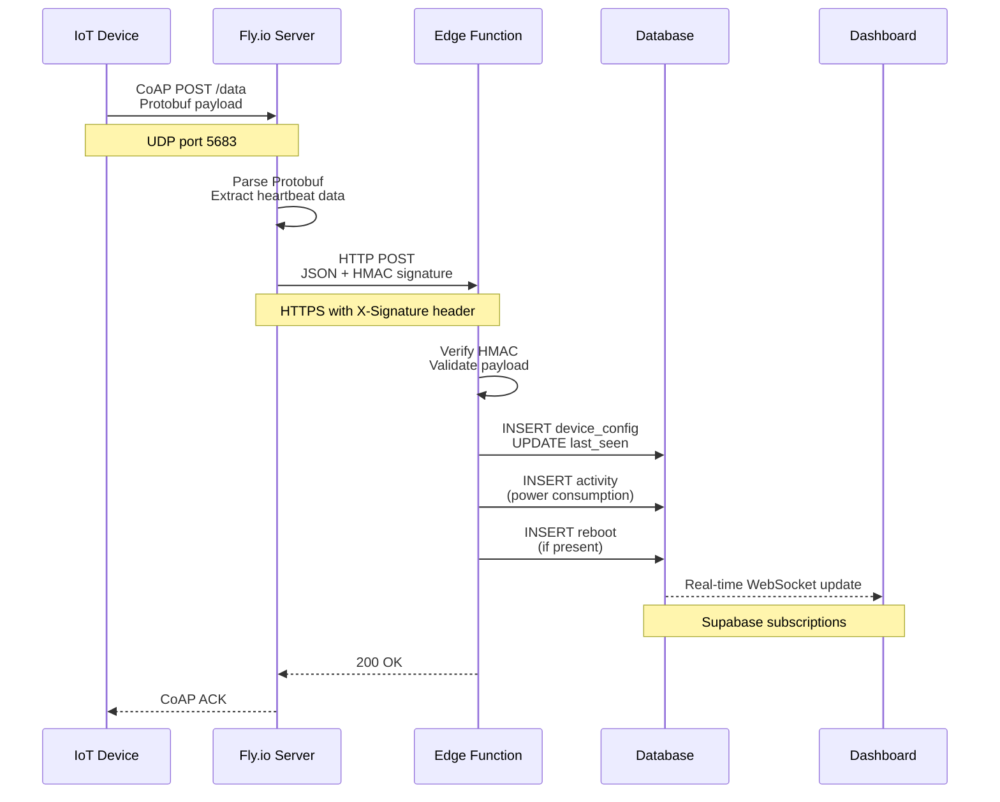
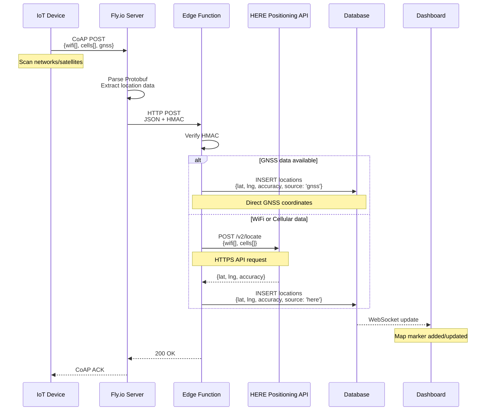
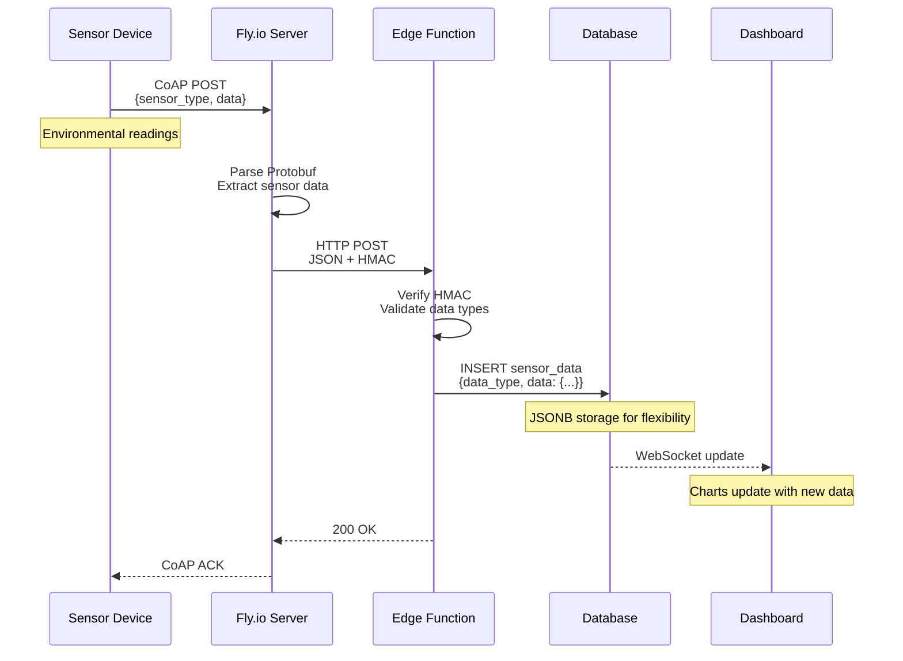
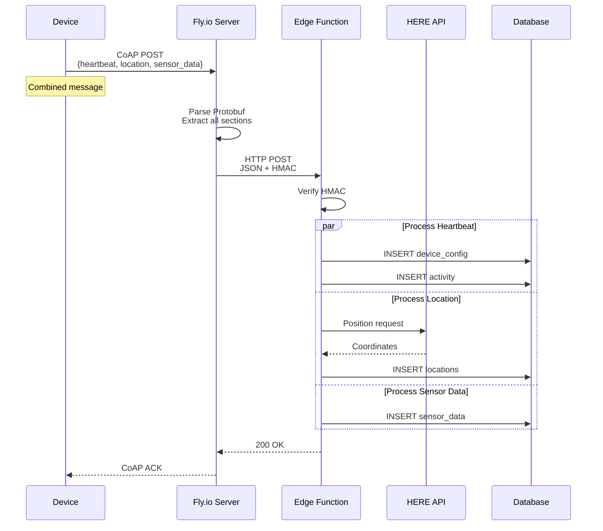
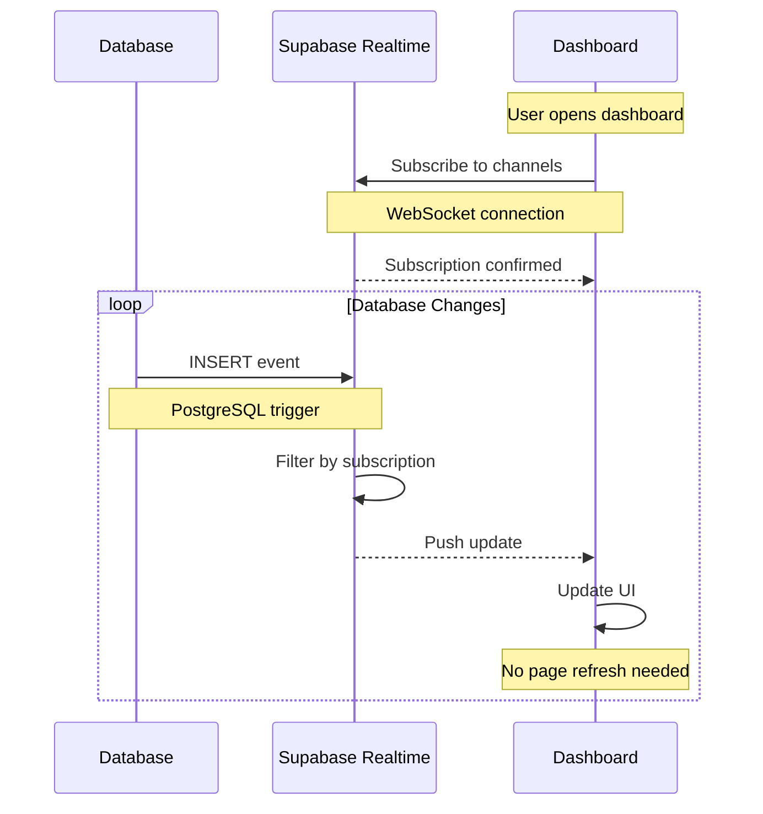
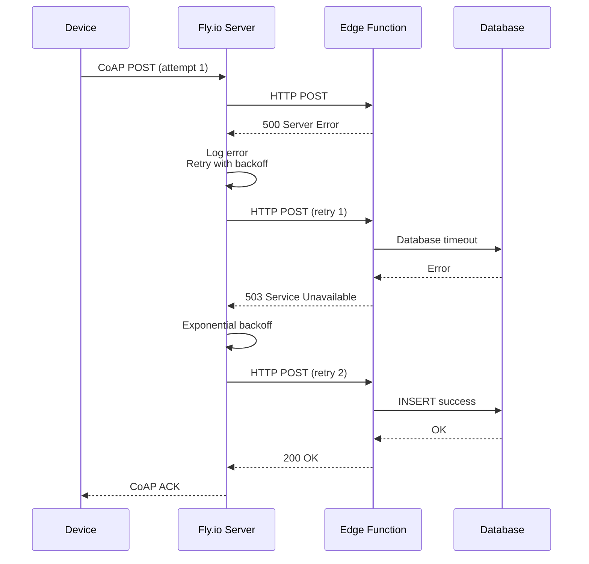

# Data Flow

This page illustrates the detailed data flow patterns for different types of device messages in the MOC-IoT system.

## Heartbeat Flow

Heartbeat messages contain device configuration, activity tracking, and optional reboot information. They are sent periodically to maintain device status.

### Data Extracted

**Device Configuration**:
- Device ID and ICCID
- Hardware/software versions
- Heartbeat interval
- Location mode setting
- Battery level
- Modem temperature

**Activity Tracking**:
- Sleep duration
- Modem active time
- GNSS usage
- WiFi scanning time
- Other operations

**Reboot Information** (optional):
- Reboot reason code
- Previous uptime
- Crash diagnostics

## Location Processing Flow

Location messages use WiFi networks, cellular towers, or GNSS satellites to determine device position. The system integrates with HERE Positioning API for WiFi/cellular triangulation.

### Location Data Types

**GNSS (GPS/GLONASS/Galileo)**:
- Latitude/longitude coordinates
- Accuracy estimate (meters)
- Timestamp
- Satellite count

**WiFi Positioning**:
- Array of nearby networks:
  - BSSID (MAC address)
  - RSSI (signal strength)
  - Channel number
- Processed by HERE API

**Cellular Positioning**:
- Array of cell towers:
  - MCC/MNC (network codes)
  - LAC/CID (cell identifiers)
  - RSSI (signal strength)
- Processed by HERE API

### Location Mode Priority

The system supports different location modes configured per device:

1. **GNSS_WIFI**: Try GNSS first, fallback to WiFi
2. **WIFI_GNSS**: Try WiFi first, fallback to GNSS
3. **GPS**: GNSS only
4. **WIFI**: WiFi triangulation only
5. **NONE**: Location disabled

## Sensor Data Flow

Sensor messages contain domain-specific measurements stored as flexible JSONB in the database.

### Supported Sensor Types

**Soil Sensors**:
- Soil moisture (%)
- Soil temperature (°C)
- NPK levels (N/P/K mg/kg)
- pH level

**Generic Sensors**:
- Custom JSONB payloads
- Extensible for future sensor types

## Multi-Message Transmission

Devices often send multiple message types in a single transmission cycle to minimize power consumption.

### Benefits of Combined Messages

**Power Efficiency**:
- Single modem wake-up cycle
- Reduced cellular handshake overhead
- Lower total transmission time

**Data Consistency**:
- All data from same timestamp
- Correlated activity and sensor readings
- Synchronized location and measurements

**Network Optimization**:
- Fewer CoAP transactions
- Reduced UDP overhead
- Better use of NB-IoT resources

## Real-Time Dashboard Updates

The dashboard receives instant updates via Supabase real-time subscriptions.

### Subscription Channels

The dashboard subscribes to specific database events:

**Device Updates**:
- Table: `device_config`
- Event: `UPDATE`
- Updates: Last seen, battery level, version changes

**Location Updates**:
- Table: `locations`
- Event: `INSERT`
- Updates: New map markers

**Sensor Data**:
- Table: `sensor_data`
- Event: `INSERT`
- Updates: Chart data points

**Activity Logs**:
- Table: `activity`
- Event: `INSERT`
- Updates: Power consumption analytics

## Error Handling and Retries

The system implements multiple layers of error recovery.

### Retry Strategy

**CoAP Bridge (Fly.io)**:
- Initial retry: 1 second delay
- Subsequent retries: Exponential backoff (2s, 4s, 8s)
- Maximum retries: 5 attempts
- Timeout: 30 seconds per attempt

**Edge Function**:
- Database retry: 3 attempts with 500ms delay
- HERE API retry: 2 attempts with 1s delay
- Timeout: 10 seconds total function execution

**Device Behavior**:
- Awaits CoAP ACK for 30 seconds
- Retries message on timeout
- Stores failed messages locally (if storage available)
- Resends on next transmission window
