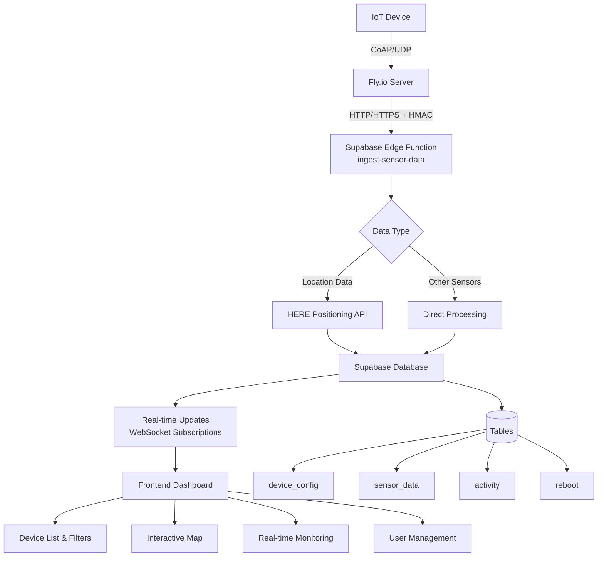
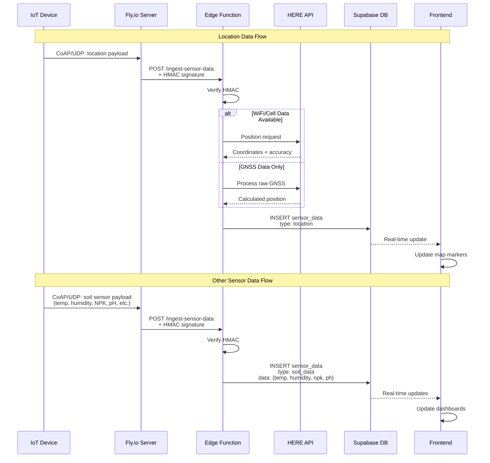
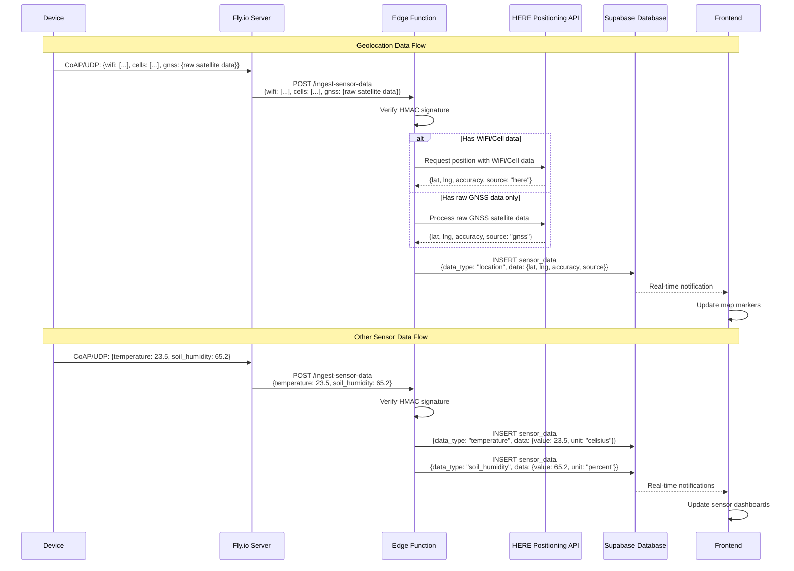

# IoT Device Management System - Architecture & Security

## Overview

This system handles IoT device data ingestion, processing, and real-time monitoring through multiple channels with robust security mechanisms.

## System Architecture

### System Architecture Diagram



### Data Flow Sequence



## Security Architecture

### 1. HMAC (Hash-based Message Authentication Code)

**What is HMAC?**
- HMAC is a cryptographic mechanism that provides both data integrity and authenticity
- It combines a secret key with the message content to create a unique signature
- Uses SHA-256 hashing algorithm in our implementation

**How it works in our system:**

```javascript
// Signature Generation (Client/Device side)
const secret = "FLY_INGEST_SECRET"
const messageBody = JSON.stringify(payload)
const signature = hmac_sha256(secret, messageBody)
const hexSignature = signature.toString('hex')

// HTTP Header
X-Signature: sha256=${hexSignature}
```

**Verification Process:**
1. Client calculates HMAC-SHA256 of the request body using shared secret
2. Client sends the signature in the `X-Signature` header
3. Server receives the request and extracts the signature
4. Server recalculates HMAC-SHA256 of the received body using the same secret
5. Server compares calculated signature with received signature
6. Request is accepted only if signatures match exactly

### 2. X-Signature Header Format

```
X-Signature: sha256=<hex_encoded_hmac_sha256_signature>
```

**Example:**
```
X-Signature: sha256=a3d2c1b4e5f6789abc123def456789abc123def456789abc123def456789abc123
```

### 3. Security Layers

#### Layer 1: Network Security
- **HTTPS/TLS**: All HTTP communications are encrypted
- **HMAC Verification**: Prevents tampering and unauthorized requests
- **Content-Type Validation**: Only accepts `application/json`

#### Layer 2: Authentication & Authorization
- **JWT Tokens**: User authentication via Supabase Auth
- **Row Level Security (RLS)**: Database-level access control
- **Role-based Access**: Admin, Moderator, User roles with different permissions

#### Layer 3: Data Validation
- **Schema Validation**: JSON payloads validated against expected structure
- **Input Sanitization**: All inputs cleaned and validated
- **Rate Limiting**: Built-in Supabase edge function rate limiting

## Step-by-Step Workflows

### Workflow 1: Sensor Data Ingestion (via Fly.io → Edge Function)

#### Prerequisites
- Device configured to send CoAP messages to Fly.io
- Fly.io configured with shared secret (`FLY_INGEST_SECRET`)
- HERE API key configured in Supabase secrets (for location data)

#### Step-by-Step Process

1. **Device Sends CoAP Message**
   ```javascript
   const payload = {
     devid: "device_001",
     wifi: [
       { mac: "AA:BB:CC:DD:EE:FF", rssi: -45 },
       { mac: "11:22:33:44:55:66", rssi: -67 }
     ],
     cells: [
       { mcc: 310, mnc: 410, lac: 12345, cid: 67890, rssi: -78 }
     ],
     gnss: {
       raw_satellite_data: "...", // Raw GNSS measurements
       timestamp: 1234567890
     }
   }
   ```

2. **Generate HMAC Signature**
   ```bash
   # Using openssl (example)
   echo -n '{"devid":"device_001",...}' | openssl dgst -sha256 -hmac "your_secret_here"
   ```

3. **Fly.io Forwards to Edge Function**
   ```bash
   # Fly.io automatically forwards to Supabase Edge Function
   curl -X POST https://cdwtsrzshpotkfbyyyjk.supabase.co/functions/v1/ingest-sensor-data \
     -H "Content-Type: application/json" \
     -H "X-Signature: sha256=calculated_signature_here" \
     -d '{"devid":"device_001","wifi":[...],"cells":[...]}'
   ```

4. **Edge Function Processing**
   - Verify HMAC signature
   - Extract device ID and sensor data
   - Determine positioning method:
     - **WiFi/Cell available**: Call HERE Positioning API
     - **GNSS only**: Process raw satellite data via HERE
     - **No location data**: Skip positioning

5. **HERE API Integration**
   ```javascript
   // WiFi/Cell positioning
   const response = await fetch('https://positioning.hereapi.com/v2/locate', {
     method: 'POST',
     headers: { 'Content-Type': 'application/json' },
     body: JSON.stringify({
       wlan: formattedWifiData,
       gsm: formattedCellData
     })
   })
   
   // GNSS processing (if raw satellite data available)
   const response = await fetch('https://positioning.hereapi.com/v2/gnss', {
     method: 'POST',
     body: gnssRawData
   })
   ```

6. **Database Storage**
   ```sql
   INSERT INTO sensor_data (devid, data_type, data, uplink_count)
   VALUES (
     'device_001',
     'location',
     '{"lat": 37.7749, "lng": -122.4194, "accuracy": 10, "source": "here"}',
     123
   )
   ```

7. **Real-time Notification**
   - Supabase automatically notifies subscribed clients
   - Frontend receives real-time update
   - Map markers updated immediately

## Updated Sequence Diagrams

### Sensor Data Flow (via Fly.io)



## Database Schema & Security

### Row Level Security (RLS) Policies

**device_config table:**
- Admins/Moderators: Full access
- Users: Can only view devices they have access to (via device_access table)

**sensor_data table:**
- Admins/Moderators: Full access
- Authenticated users: Read-only access to all sensor data

**user_roles table:**
- Admins: Full access
- Users: Can only view their own roles

### Real-time Subscriptions

```javascript
// Frontend subscribes to real-time updates
const subscription = supabase
  .channel('sensor-updates')
  .on('postgres_changes', {
    event: 'INSERT',
    schema: 'public',
    table: 'sensor_data'
  }, (payload) => {
    // Update UI with new sensor data
    updateSensorDisplay(payload.new)
  })
  .subscribe()
```

## Security Best Practices Implemented

1. **Never store secrets in code** - All sensitive data in Supabase secrets
2. **HMAC verification** - Prevents unauthorized data injection
3. **HTTPS/TLS encryption** - All network traffic encrypted
4. **Row Level Security** - Database-level access control
5. **JWT authentication** - Secure user sessions
6. **Input validation** - All inputs sanitized and validated
7. **Rate limiting** - Built-in protection against abuse
8. **Audit logging** - All database changes logged with timestamps

## Testing & Debugging

### HMAC Signature Testing

```bash
# Generate test signature
SECRET="your_secret_here"
PAYLOAD='{"devid":"test_device","temperature":25.0}'
SIGNATURE=$(echo -n "$PAYLOAD" | openssl dgst -sha256 -hmac "$SECRET" | cut -d' ' -f2)

# Test API call
curl -X POST https://your-project.supabase.co/functions/v1/ingest-sensor-data \
  -H "Content-Type: application/json" \
  -H "X-Signature: sha256=$SIGNATURE" \
  -d "$PAYLOAD"
```

### Monitoring & Logs

- **Edge Function Logs**: Available in Supabase dashboard
- **Database Logs**: Query postgres_logs for database operations
- **Real-time Debugging**: Use browser dev tools to monitor WebSocket connections