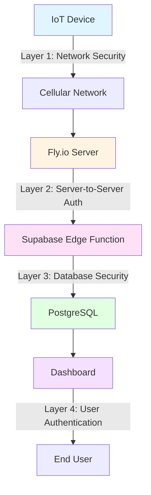
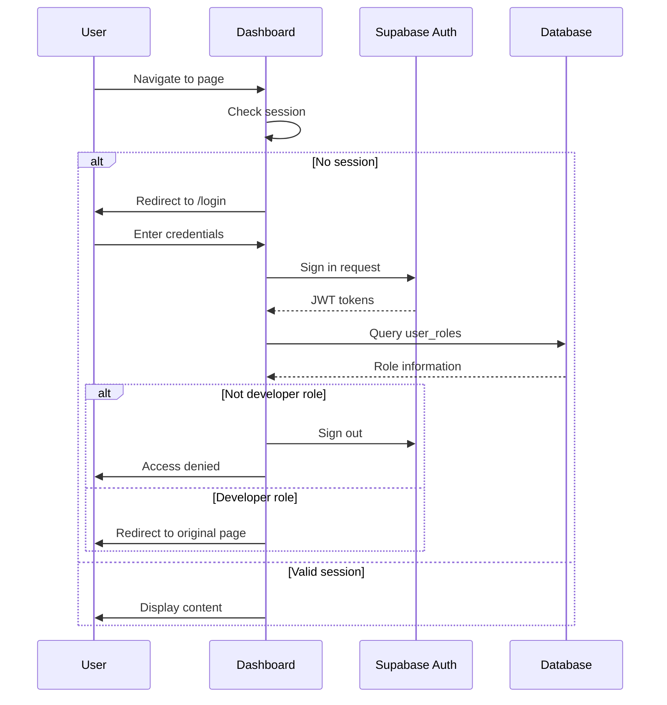

# Security Architecture

This page describes the security model and implementation across all layers of the MOC-IoT system.

## Security Overview

The MOC-IoT system implements defense-in-depth security with multiple layers protecting against unauthorized access, data tampering, and privacy breaches.

### Security Layers



## Layer 1: Device-to-Server Security

### Network-Level Protection

**Cellular Network Encryption**:
- All NB-IoT/LTE traffic encrypted by cellular provider
- End-to-end encryption from device to cell tower
- Protects against over-the-air interception
- No additional VPN or TLS required for device communication

**CoAP Protocol**:
- UDP-based, minimal overhead
- Optional DTLS support (not currently implemented)
- CoAP-level message deduplication
- Confirmable messages with acknowledgments

### Device Identification

**Device ID**:
- Unique identifier embedded in protobuf payload
- Registered in database before activation
- Whitelist-based access control
- No anonymous device submissions

**ICCID Validation**:
- SIM card identifier included in heartbeat messages
- Cross-referenced with device records
- Detects SIM swap or device cloning attempts
- Alerts for mismatched device/SIM combinations

### Message Integrity

**Protobuf Schema Validation**:
- Binary format prevents arbitrary JSON injection
- Strong typing enforces field types
- Required field checking at parse time
- Invalid messages rejected before processing

**Message Counter**:
- Sequential `uplink_count` field in all messages
- Server tracks expected sequence numbers
- Detects replay attacks or message duplication
- Gaps logged for investigation

## Layer 2: Server-to-Server Authentication

### HMAC Signature Verification

All requests from Fly.io to Supabase Edge Functions are authenticated using HMAC-SHA256 signatures.

**What is HMAC?**:
- **Hash-based Message Authentication Code**
- Combines shared secret with message content
- Creates unique, unforgeable signature
- Provides both authentication and integrity

### HMAC Implementation

**Signature Generation** (Fly.io Server):

```python
import hmac
import hashlib
import json

def generate_signature(secret_key: str, payload: dict) -> str:
    # Serialize payload to JSON (no whitespace)
    message = json.dumps(payload, separators=(',', ':')).encode('utf-8')

    # Calculate HMAC-SHA256
    signature = hmac.new(
        secret_key.encode('utf-8'),
        message,
        hashlib.sha256
    ).hexdigest()

    # Return formatted header value
    return f"sha256={signature}"

# Example usage
payload = {"devid": "12345", "data": {...}}
signature = generate_signature(FLY_INGEST_SECRET, payload)

# Send HTTP request with signature
headers = {
    "Content-Type": "application/json",
    "X-Signature": signature
}
```

**Signature Verification** (Supabase Edge Function):

```typescript
async function verifySignature(request: Request): Promise<boolean> {
  const secret = Deno.env.get('FLY_INGEST_SECRET')
  const signature = request.headers.get('X-Signature')

  if (!signature || !signature.startsWith('sha256=')) {
    return false
  }

  const receivedSignature = signature.substring(7) // Remove 'sha256=' prefix
  const body = await request.text()

  // Calculate expected signature
  const encoder = new TextEncoder()
  const key = await crypto.subtle.importKey(
    'raw',
    encoder.encode(secret),
    { name: 'HMAC', hash: 'SHA-256' },
    false,
    ['sign']
  )

  const signature_buffer = await crypto.subtle.sign('HMAC', key, encoder.encode(body))
  const expectedSignature = Array.from(new Uint8Array(signature_buffer))
    .map(b => b.toString(16).padStart(2, '0'))
    .join('')

  // Constant-time comparison to prevent timing attacks
  return receivedSignature === expectedSignature
}
```

### X-Signature Header Format

```http
POST /functions/v1/ingest-sensor-data HTTP/1.1
Host: cdwtsrzshpotkfbyyyjk.supabase.co
Content-Type: application/json
X-Signature: sha256=a3d2c1b4e5f6789abc123def456789abc123def456789abc123def456789abc123

{"devid": "12345", "uplink_count": 42, ...}
```

**Header Components**:
- Prefix: `sha256=`
- Hash: Hex-encoded HMAC-SHA256 signature (64 characters)
- Calculated over: Exact request body (no modifications)

### HMAC Security Properties

**Authentication**:
- Only servers with shared secret can generate valid signatures
- Proves request originated from authorized Fly.io server
- Prevents third-party data injection

**Integrity**:
- Signature changes if message is modified
- Detects tampering during transmission
- Guarantees data received matches data sent

**Replay Protection**:
- Combined with message counter checks
- Timestamp validation in Edge Function
- Duplicate message detection

## Layer 3: Database Security

### Row Level Security (RLS)

Supabase PostgreSQL enforces Row Level Security policies on all tables.

**device_config Table**:

```sql
-- Admins and moderators can see all devices
CREATE POLICY "admin_moderator_all_access" ON device_config
  FOR ALL
  TO authenticated
  USING (
    EXISTS (
      SELECT 1 FROM user_roles
      WHERE user_id = auth.uid()
      AND role IN ('admin', 'moderator')
    )
  );

-- Regular users can only see devices they have access to
CREATE POLICY "user_device_access" ON device_config
  FOR SELECT
  TO authenticated
  USING (
    EXISTS (
      SELECT 1 FROM device_access
      WHERE user_id = auth.uid()
      AND devid = device_config.devid
    )
  );
```

**sensor_data Table**:

```sql
-- Admins and moderators have full access
CREATE POLICY "admin_moderator_all_access" ON sensor_data
  FOR ALL
  TO authenticated
  USING (
    EXISTS (
      SELECT 1 FROM user_roles
      WHERE user_id = auth.uid()
      AND role IN ('admin', 'moderator')
    )
  );

-- Authenticated users have read-only access
CREATE POLICY "authenticated_read_only" ON sensor_data
  FOR SELECT
  TO authenticated
  USING (true);
```

**user_roles Table**:

```sql
-- Admins can manage all roles
CREATE POLICY "admin_all_access" ON user_roles
  FOR ALL
  TO authenticated
  USING (
    EXISTS (
      SELECT 1 FROM user_roles
      WHERE user_id = auth.uid()
      AND role = 'admin'
    )
  );

-- Users can view their own role
CREATE POLICY "user_view_own_role" ON user_roles
  FOR SELECT
  TO authenticated
  USING (user_id = auth.uid());
```

### Role-Based Access Control (RBAC)

**Role Hierarchy**:

| Role | Capabilities |
|------|--------------|
| **admin** | Full system access, user management, all devices |
| **moderator** | All devices, sensor data, no user management |
| **developer** | Documentation access, read-only data access |
| **user** | Assigned devices only, limited data access |

**Permission Matrix**:

| Resource | Admin | Moderator | Developer | User |
|----------|-------|-----------|-----------|------|
| All devices | ✅ Full | ✅ Full | ❌ None | 🔒 Assigned only |
| Sensor data | ✅ Full | ✅ Full | 👁️ Read-only | 👁️ Read-only |
| User management | ✅ Full | ❌ None | ❌ None | ❌ None |
| Documentation | ✅ Full | ✅ Full | ✅ Full | ❌ None |
| Device config | ✅ Edit | ✅ Edit | ❌ None | 👁️ Read-only |

### Data Validation

**Input Sanitization**:
- All edge function inputs validated against schema
- SQL injection prevented by parameterized queries
- XSS prevention via proper encoding
- Type checking on all database inserts

**Constraint Enforcement**:
- Foreign key constraints ensure referential integrity
- Check constraints validate data ranges
- Unique constraints prevent duplicates
- Not-null constraints enforce required fields

## Layer 4: User Authentication

### Supabase Auth

**Authentication Methods**:
- Email/password authentication
- JWT token-based sessions
- Secure session storage
- Automatic token refresh

**Session Management**:
- Short-lived access tokens (1 hour)
- Long-lived refresh tokens (30 days)
- Secure cookie storage
- Automatic logout on token expiration

### Dashboard Authentication Flow



### JWT Token Structure

**Access Token Claims**:
```json
{
  "sub": "user-uuid",
  "email": "user@example.com",
  "role": "authenticated",
  "iat": 1234567890,
  "exp": 1234571490
}
```

**Security Features**:
- Signed with secret key
- Expiration time enforced
- Cannot be forged or modified
- Validated on every request

## Security Best Practices Implemented

### 1. Secret Management

**Environment Variables**:
- All secrets stored in platform-specific secret managers
- Fly.io: `flyctl secrets set`
- Supabase: Dashboard secrets management
- Never committed to version control

**Secret Rotation**:
- Regular HMAC secret rotation schedule
- Database credentials rotated quarterly
- API keys monitored for exposure

### 2. Encryption

**Data in Transit**:
- TLS 1.3 for all HTTPS connections
- Cellular network encryption for device traffic
- WebSocket connections over WSS

**Data at Rest**:
- Supabase encrypts database at rest
- Automatic backups encrypted
- Secrets encrypted in storage

### 3. Rate Limiting

**Supabase Edge Functions**:
- Built-in rate limiting per IP address
- Prevents brute force attacks
- DDoS mitigation

**Dashboard**:
- Login attempt throttling
- Password reset rate limits
- API request quotas

### 4. Audit Logging

**Database Changes**:
- All inserts/updates include timestamps
- Created/updated by user tracking
- Immutable audit trail

**Authentication Events**:
- Login attempts logged
- Failed authentication tracked
- Suspicious activity alerting

### 5. Vulnerability Management

**Dependency Scanning**:
- Regular `npm audit` and `pip-audit` runs
- Automated security updates
- CVE monitoring

**Code Security**:
- Input validation on all endpoints
- Output encoding to prevent XSS
- Parameterized queries prevent SQL injection
- CSRF protection enabled

## Security Monitoring

### Metrics to Monitor

**Authentication**:
- Failed login attempts
- Unusual login patterns
- Token expiration rates

**Data Ingestion**:
- HMAC verification failures
- Invalid device IDs
- Message parsing errors

**Database**:
- RLS policy violations
- Unauthorized access attempts
- Query performance anomalies

### Incident Response

**Detection**:
- Automated alerts for suspicious activity
- Log aggregation and analysis
- Real-time monitoring dashboards

**Response**:
1. Identify affected systems
2. Isolate compromised components
3. Rotate exposed secrets
4. Patch vulnerabilities
5. Restore from backups if needed
6. Post-mortem analysis

## Compliance Considerations

**Data Privacy**:
- GDPR compliance for EU users
- User data deletion capabilities
- Privacy policy enforcement

**Data Retention**:
- Configurable retention policies
- Automated data archival
- Secure data deletion

**Access Controls**:
- Principle of least privilege
- Regular access audits
- Automated access reviews
