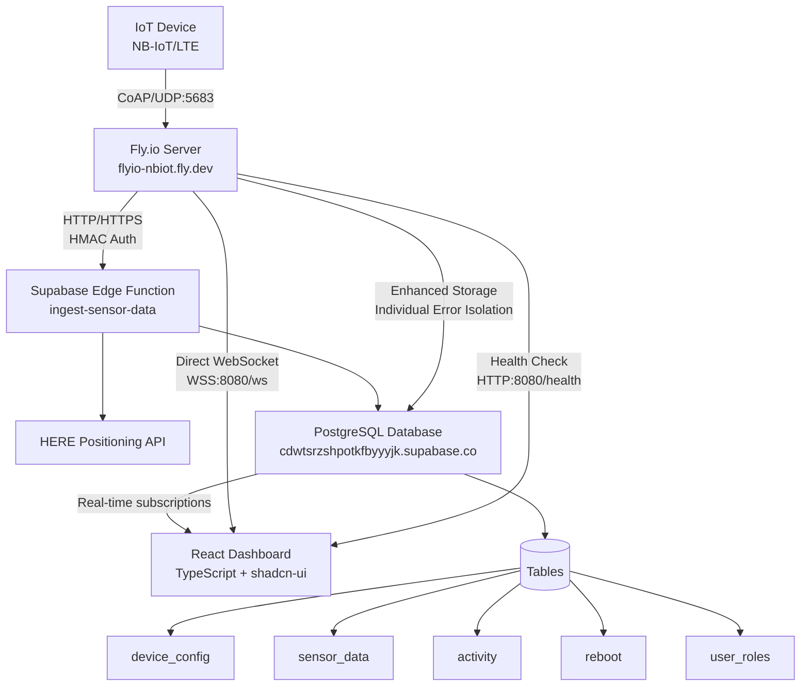
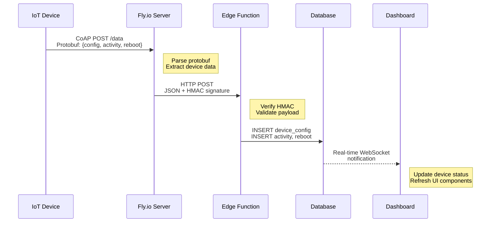
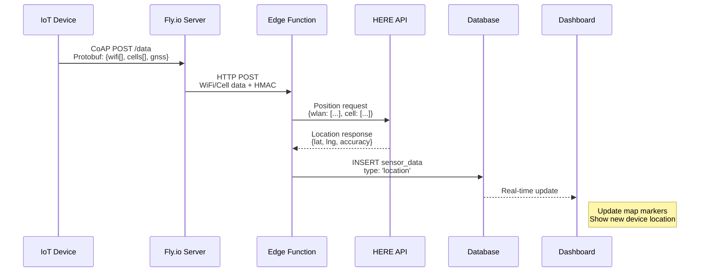
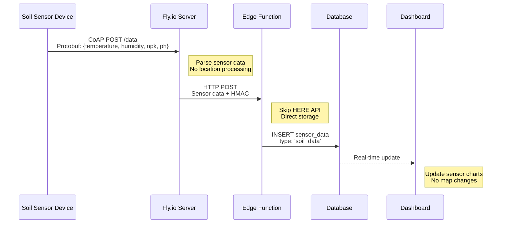
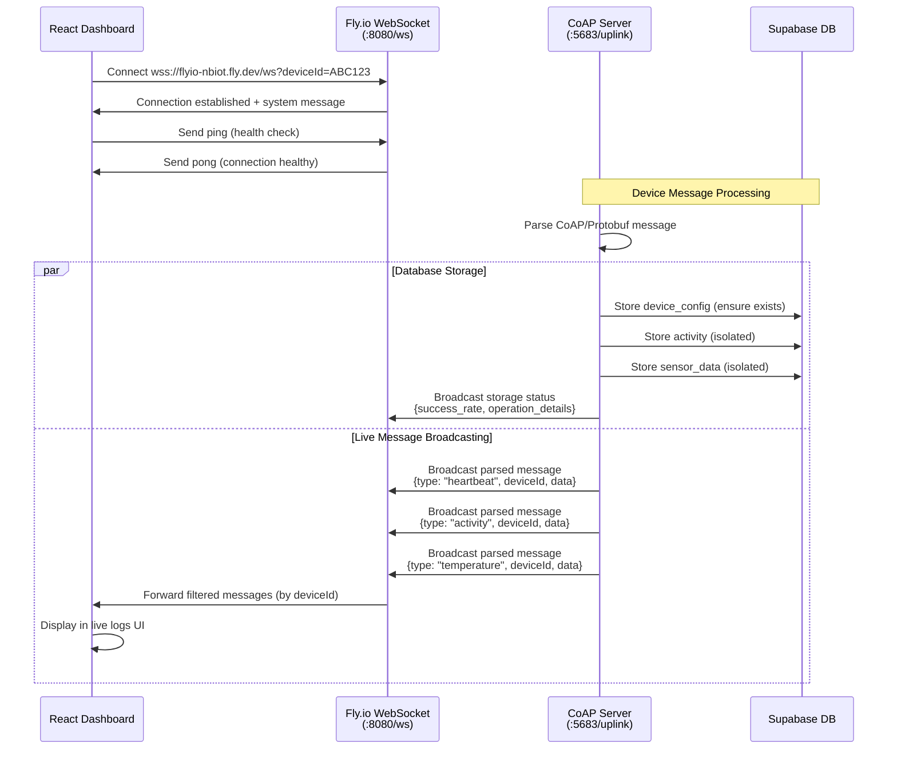
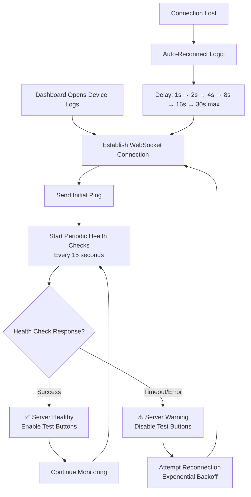
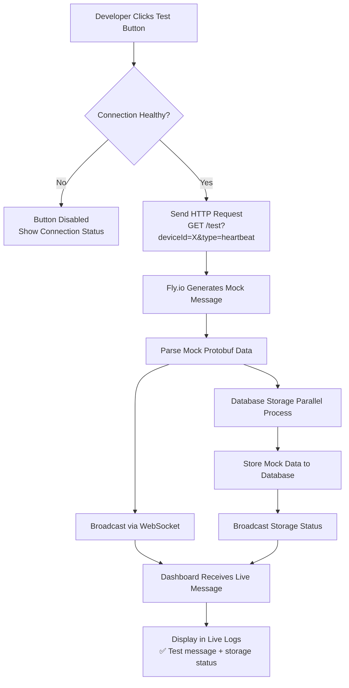

# System Overview

The MOC-IoT system is a distributed IoT device management platform designed for monitoring and tracking devices via cellular networks. The architecture prioritizes reliability, scalability, and real-time data processing.

## High-Level Architecture



### Architecture Evolution (v2.0)

**New Features:**
- **Direct WebSocket Connection**: Dashboard connects directly to Fly.io for live logs (eliminated Supabase relay)
- **Health Monitoring**: Real-time connection health checks and diagnostics
- **Enhanced Database Storage**: Individual operation isolation prevents cascade failures
- **Test Message System**: Built-in message simulation for debugging

**Benefits:**
- 50% fewer failure points in WebSocket chain
- Better error visibility and debugging
- Improved connection reliability
- Real-time storage status feedback

## Component Responsibilities

### 1. IoT Devices
- **Communication**: Send data via CoAP protocol over NB-IoT/LTE cellular networks
- **Message Format**: Protocol Buffers for efficient serialization
- **Target**: `flyio-nbiot.fly.dev:5683` (UDP)
- **Authentication**: Devices authenticated via message content validation

### 2. CoAP Bridge (Fly.io Server)
- **Location**: `flyio-nbiot` app on Fly.io platform
- **Runtime**: Python 3.11 with asyncio
- **Primary Function**: Receive CoAP messages, parse Protocol Buffers, forward to Supabase
- **Libraries**: aiocoap, aiohttp, protobuf, colorlog
- **Configuration**: Environment variables for Supabase connection

### 3. Supabase Backend
- **Edge Functions**: Handle HTTP requests from CoAP bridge
- **Database**: PostgreSQL with Row Level Security (RLS)
- **Real-time**: WebSocket subscriptions for live updates
- **Location Services**: Integration with HERE Positioning API
- **Project**: `cdwtsrzshpotkfbyyyjk.supabase.co`

### 4. React Dashboard
- **Framework**: React 18 + TypeScript + Vite
- **UI Components**: shadcn-ui with Tailwind CSS
- **State Management**: TanStack Query for server state
- **Mapping**: Leaflet for interactive device locations
- **Authentication**: Supabase Auth with role-based access

## Technology Choices

### Why CoAP?
- **Lightweight**: Minimal overhead for battery-powered devices
- **UDP-based**: Suitable for cellular networks with intermittent connectivity
- **Standardized**: RFC 7252 specification ensures interoperability

### Why Protocol Buffers?
- **Efficiency**: 3-10x smaller than JSON for typical IoT payloads
- **Schema Evolution**: Backward and forward compatibility for firmware updates
- **Language Support**: Generated code for Python (server) and C++ (firmware)

### Why Fly.io?
- **Global Edge**: Servers deployed close to cellular network gateways
- **UDP Support**: Native support for CoAP protocol requirements
- **Container Platform**: Easy deployment and scaling of Python applications
- **Cost Effective**: Pay-per-use model suitable for IoT workloads

### Why Supabase?
- **Real-time**: Built-in WebSocket subscriptions for dashboard updates
- **Edge Functions**: Serverless compute for data processing
- **PostgreSQL**: Flexible JSON storage for diverse sensor data
- **Authentication**: Built-in auth system with role-based access control

## Data Flow Sequences

### Device Heartbeat Flow



### Location Data Processing



### Sensor Data Processing (Non-Geolocation)



## Data Processing Logic

### Message Type Routing
The Edge Function automatically determines how to process incoming data based on message content:

#### Location Data (Uses HERE API)
- **Triggers**: Messages containing `wifi[]`, `cells[]`, or `gnss` data
- **Processing**: Sent to HERE Positioning API for coordinate calculation
- **Storage**: Results stored as `sensor_data` with `data_type: 'location'`
- **Dashboard Impact**: Updates device location on map

#### Sensor Data (Direct Storage)
- **Triggers**: Messages containing sensor readings (temperature, humidity, soil data, etc.)
- **Processing**: Direct validation and storage, no external APIs
- **Storage**: Stored as `sensor_data` with appropriate `data_type` (e.g., 'soil_data', 'temperature')
- **Dashboard Impact**: Updates sensor charts and readings

#### Configuration Data (Device Management)
- **Triggers**: Messages containing device configuration updates
- **Processing**: Updates device metadata and settings
- **Storage**: Updates `device_config` table
- **Dashboard Impact**: Refreshes device status and information

### Response Times
- **CoAP Processing**: < 50ms average
- **Edge Function**: < 200ms (with HERE API), < 50ms (sensor data only)
- **Database Operations**: < 100ms for typical queries
- **Dashboard Updates**: Real-time (< 1 second)

## Security Architecture

### Device-to-Server Security
- **Device Identification**: Devices identified by `dev_id` field in protobuf payload
- **Message Integrity**: Payload validation via protobuf schema
- **Network Security**: Cellular network encryption (LTE/NB-IoT)

### Server-to-Server Security
- **HMAC Authentication**: All Fly.io → Supabase requests signed with shared secret
- **TLS Encryption**: All HTTP/HTTPS communications encrypted
- **Environment Isolation**: Secrets stored in Fly.io and Supabase environments

### Dashboard Security
- **User Authentication**: Email/password via Supabase Auth
- **Role-Based Access**: Developer, admin, moderator, user roles with different permissions
- **Row Level Security**: Database-level access control policies
- **Session Management**: JWT tokens with configurable expiration

## Live Logging System (v2.0)

The enhanced live logging system provides real-time visibility into device activity and system health for development and debugging purposes.

### WebSocket Architecture



### Health Monitoring System

#### Connection Health Tracking


#### Health Check Endpoints

**Basic Health Check:**
```bash
GET https://flyio-nbiot.fly.dev/health
```

**Response:**
```json
{
  "status": "healthy",
  "timestamp": "2024-01-15T10:30:00.000Z",
  "server_info": {
    "version": "1.0",
    "live_logs_token_configured": true
  },
  "websocket_connections": {
    "total_connections": 3,
    "active_devices": 2,
    "device_connections": {
      "ABC123": 1,
      "XYZ789": 2
    }
  },
  "database_config": {
    "supabase_url_configured": true,
    "supabase_api_key_configured": true
  }
}
```

**Detailed Diagnostics:**
```bash
GET https://flyio-nbiot.fly.dev/health?detailed=true
```

Includes additional connection metadata, ping statistics, and client information.

### Test Message System

Built-in test message generation for development and debugging:



**Available Test Types:**
- `heartbeat` - Device configuration and activity data
- `activity` - Power consumption metrics only
- `temperature` - Temperature sensor readings
- `location` - WiFi scanning data
- `random` - Mixed message types

### Database Storage Enhancement

Enhanced storage system with error isolation and detailed reporting:

```mermaid
flowchart TD
    A[Parsed Device Message] --> B{device_config Data?}
    B -->|Yes| C[Upsert device_config<br/>Critical Priority]
    B -->|No| D[Check Device Exists<br/>in Database]
    
    D -->|Found| E[Device OK - Proceed]
    D -->|Missing| F[Create Minimal Record<br/>devid only]
    C --> G{Config Success?}
    F --> H{Creation Success?}
    
    G -->|Yes| E
    G -->|No| I[❌ Abort - No Foreign Key]
    H -->|Yes| E  
    H -->|No| I
    
    E --> J[Execute Operations Individually<br/>Error Isolation]
    
    J --> K[Activity Storage]
    J --> L[Reboot Storage]
    J --> M[Temperature Storage] 
    J --> N[WiFi Location Storage]
    
    K --> O[✅/❌ Activity Result]
    L --> P[✅/❌ Reboot Result]
    M --> Q[✅/❌ Temperature Result]
    N --> R[✅/❌ WiFi Result]
    
    O --> S[Generate Storage Report<br/>{successful_operations/total_operations}]
    P --> S
    Q --> S
    R --> S
    
    S --> T[Broadcast Storage Status<br/>to WebSocket Clients]
    T --> U[Live Logs Show<br/>"Database storage: 3/4 operations successful"]
```

### Performance Characteristics

#### WebSocket Performance
- **Connection Establishment**: < 500ms
- **Message Delivery Latency**: < 100ms from server to dashboard
- **Ping/Pong Round Trip**: < 200ms
- **Auto-reconnection Delay**: 1s to 30s (exponential backoff)

#### Database Storage Performance  
- **Individual Operation Timeout**: 10s per operation
- **Typical Storage Time**: 50-200ms per operation
- **Foreign Key Validation**: < 10ms
- **Success Rate Target**: > 95% for healthy systems

#### Health Monitoring
- **Health Check Frequency**: Every 15 seconds (dashboard-initiated)
- **Server Health Response**: < 100ms
- **Connection Metadata Tracking**: Real-time
- **Dead Connection Cleanup**: Automatic (on WebSocket close)

### Security Considerations

#### WebSocket Security
- **Connection Authentication**: Optional token-based authentication
- **Message Filtering**: Server filters messages by deviceId parameter  
- **Rate Limiting**: Built-in WebSocket frame rate limits
- **CORS Handling**: Configured for dashboard domain access

#### Health Endpoint Security
- **Public Access**: Health endpoints are publicly accessible (no sensitive data)
- **Rate Limiting**: Standard HTTP rate limits apply
- **Information Disclosure**: Only aggregate statistics, no sensitive device data

This enhanced architecture provides developers with comprehensive visibility into system health, real-time debugging capabilities, and robust error handling for production deployments.