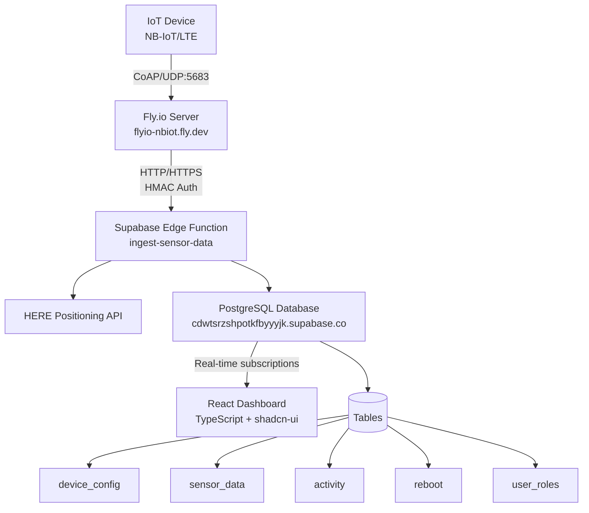
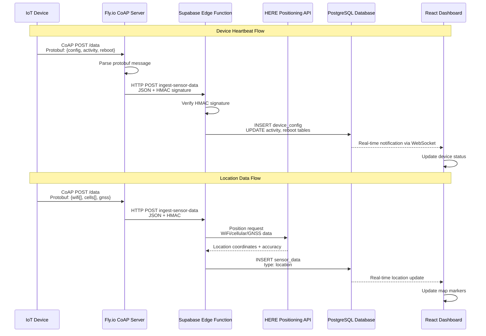

# System Overview

The MOC-IoT system is a distributed IoT device management platform designed for monitoring and tracking devices via cellular networks. The architecture prioritizes reliability, scalability, and real-time data processing.

## High-Level Architecture

## Component Responsibilities

### 1. IoT Devices
- **Communication**: Send data via CoAP protocol over NB-IoT/LTE cellular networks
- **Message Format**: Protocol Buffers for efficient serialization
- **Target**: `flyio-nbiot.fly.dev:5683` (UDP)
- **Authentication**: Devices authenticated via message content validation

### 2. CoAP Bridge (Fly.io Server)
- **Location**: `flyio-nbiot` app on Fly.io platform
- **Runtime**: Python 3.11 with asyncio
- **Primary Function**: Receive CoAP messages, parse Protocol Buffers, forward to Supabase
- **Libraries**: aiocoap, aiohttp, protobuf, colorlog
- **Configuration**: Environment variables for Supabase connection

### 3. Supabase Backend
- **Edge Functions**: Handle HTTP requests from CoAP bridge
- **Database**: PostgreSQL with Row Level Security (RLS)
- **Real-time**: WebSocket subscriptions for live updates
- **Location Services**: Integration with HERE Positioning API
- **Project**: `cdwtsrzshpotkfbyyyjk.supabase.co`

### 4. React Dashboard
- **Framework**: React 18 + TypeScript + Vite
- **UI Components**: shadcn-ui with Tailwind CSS
- **State Management**: TanStack Query for server state
- **Mapping**: Leaflet for interactive device locations
- **Authentication**: Supabase Auth with role-based access

## Technology Choices

### Why CoAP?
- **Lightweight**: Minimal overhead for battery-powered devices
- **UDP-based**: Suitable for cellular networks with intermittent connectivity
- **Standardized**: RFC 7252 specification ensures interoperability

### Why Protocol Buffers?
- **Efficiency**: 3-10x smaller than JSON for typical IoT payloads
- **Schema Evolution**: Backward and forward compatibility for firmware updates
- **Language Support**: Generated code for Python (server) and C++ (firmware)

### Why Fly.io?
- **Global Edge**: Servers deployed close to cellular network gateways
- **UDP Support**: Native support for CoAP protocol requirements
- **Container Platform**: Easy deployment and scaling of Python applications
- **Cost Effective**: Pay-per-use model suitable for IoT workloads

### Why Supabase?
- **Real-time**: Built-in WebSocket subscriptions for dashboard updates
- **Edge Functions**: Serverless compute for data processing
- **PostgreSQL**: Flexible JSON storage for diverse sensor data
- **Authentication**: Built-in auth system with role-based access control

## Data Flow Sequence

## Performance Characteristics

### Expected Load
- **Devices**: 100-10,000 IoT devices
- **Message Rate**: 1-10 messages per device per hour
- **Peak Load**: ~1000 messages per minute
- **Data Retention**: 2+ years of sensor data

### Response Times
- **CoAP Processing**: < 50ms average
- **Edge Function**: < 200ms including HERE API calls
- **Database Operations**: < 100ms for typical queries
- **Dashboard Updates**: Real-time (< 1 second)

### Scalability Limits
- **Fly.io**: Auto-scaling based on CPU/memory usage
- **Supabase**: 500+ concurrent connections, 2GB+ database
- **HERE API**: 250,000 positioning requests per month (current plan)

## Security Architecture

### Device-to-Server Security
- **No Device Authentication**: Devices identified by payload content
- **Message Integrity**: Payload validation via protobuf schema
- **Network Security**: Cellular network encryption (LTE/NB-IoT)

### Server-to-Server Security
- **HMAC Authentication**: All Fly.io → Supabase requests signed with shared secret
- **TLS Encryption**: All HTTP/HTTPS communications encrypted
- **Environment Isolation**: Secrets stored in Fly.io and Supabase environments

### Dashboard Security
- **User Authentication**: Email/password via Supabase Auth
- **Role-Based Access**: Admin, moderator, user roles with different permissions
- **Row Level Security**: Database-level access control policies
- **Session Management**: JWT tokens with configurable expiration