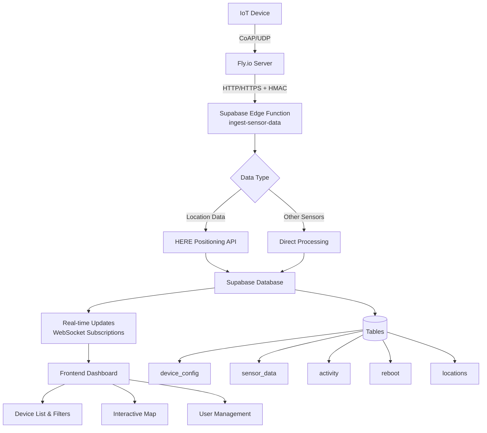

# System Overview

MOC-IoT is a comprehensive IoT device tracking system designed for monitoring NB-IoT connected devices through a microservices architecture.

## Core Components

- **IoT Devices**: NB-IoT/LTE devices sending data via CoAP with Protocol Buffers
- **CoAP Bridge**: Python 3.11 server on Fly.io handling device communication
- **Backend**: Supabase (PostgreSQL + Edge Functions + Real-time subscriptions)
- **Frontend**: React + TypeScript dashboard with shadcn-ui

## High-Level Data Flow

1. Devices encode data with Protobuf → send via CoAP
2. Fly.io server receives/validates → converts to JSON
3. Forward to Supabase Edge Functions with HMAC signature
4. Edge functions validate → process location (HERE API) → store in PostgreSQL
5. Real-time WebSocket updates → Dashboard displays

## System Architecture Diagram

## Component Descriptions

### 1. IoT Devices

**Purpose**: Battery-powered devices transmitting sensor data and location information

**Communication**:
- Protocol: CoAP over NB-IoT/LTE cellular networks
- Encoding: Protocol Buffers for compact binary serialization
- Target: `flyio-nbiot.fly.dev:5683` (UDP)

**Capabilities**:
- Multi-mode location (GNSS, WiFi, Cellular)
- Sensor data collection (temperature, humidity, soil moisture, etc.)
- Power consumption tracking
- Remote configuration updates

### 2. CoAP Bridge (Fly.io)

**Purpose**: Protocol translator between IoT devices and cloud backend

**Deployment**:
- Platform: Fly.io container deployment
- App Name: `flyio-nbiot`
- Runtime: Python 3.11 with asyncio
- Region: Global edge locations

**Responsibilities**:
- Receive CoAP messages on UDP port 5683
- Parse and validate Protocol Buffer payloads
- Transform binary data to JSON format
- Forward to Supabase with HMAC authentication
- Handle retries and error recovery

**Key Libraries**:
- `aiocoap`: Asynchronous CoAP protocol handling
- `aiohttp`: HTTP client for Supabase communication
- `protobuf`: Message parsing and validation

### 3. Supabase Backend

**Purpose**: Centralized data storage, processing, and real-time distribution

**Components**:
- **Edge Functions**: Serverless HTTP endpoints for data ingestion (`ingest-sensor-data`)
- **PostgreSQL Database**: Structured data storage with Row Level Security
- **Real-time Engine**: WebSocket-based subscriptions for live updates
- **Authentication**: User management and session handling

**External Integrations**:
- HERE Positioning API for WiFi/cellular location triangulation
- HMAC signature verification for server-to-server authentication

**Database Tables**:
- `device_config`: Device metadata, versions, heartbeat tracking
- `sensor_data`: Flexible JSONB storage for various sensor types
- `locations`: Dedicated location data with coordinates and accuracy
- `activity`: Power consumption per message
- `reboot`: Device restart/crash diagnostics
- `profiles`: User profile information
- `user_roles`: Role-based access control (admin/moderator/developer/user)
- `device_access`: User-device permissions

### 4. React Dashboard

**Purpose**: Web-based interface for real-time device monitoring and management

**Technology Stack**:
- React 18 + TypeScript + Vite
- shadcn-ui + Tailwind CSS
- TanStack Query (state management)
- Leaflet (interactive maps)
- Recharts (data visualization)

**Features**:
- Real-time device status monitoring
- Interactive location mapping
- Sensor data visualization
- User and device access management
- Role-based permissions

## Technology Choices & Rationale

### CoAP Protocol
- **Lightweight**: Minimal overhead for battery-powered devices
- **UDP-based**: Efficient for intermittent connectivity
- **Low bandwidth**: Critical for NB-IoT cellular networks
- **Designed for IoT**: Built-in support for constrained devices

### Protocol Buffers
- **Compact**: 3-10x smaller than JSON payloads
- **Schema evolution**: Backward/forward compatibility
- **Type safety**: Compile-time validation
- **Cross-language**: Consistent definitions across firmware, server, dashboard

### Fly.io Platform
- **Global edge deployment**: Low latency worldwide
- **Native UDP support**: Direct CoAP protocol handling
- **Container-based**: Easy deployment and scaling
- **Anycast routing**: Automatic geographic load balancing

### Supabase Backend
- **Real-time subscriptions**: WebSocket updates to dashboard
- **PostgreSQL**: ACID compliance, complex queries, JSONB flexibility
- **Edge functions**: Serverless, auto-scaling
- **Built-in authentication**: JWT tokens, Row Level Security
- **Developer experience**: Auto-generated TypeScript types

## Message Routing Logic

The system automatically routes incoming data based on message content:

### Location Data Processing
**Triggers**: Messages containing `wifi[]`, `cells[]`, or `gnss` fields
**Flow**: CoAP Bridge → Edge Function → HERE API → `locations` table
**Dashboard**: Map markers update in real-time via WebSocket

### Sensor Data Processing
**Triggers**: Sensor readings (temperature, humidity, soil, etc.)
**Flow**: CoAP Bridge → Edge Function → `sensor_data` table
**Dashboard**: Charts update with new data points

### Device Configuration
**Triggers**: Heartbeat messages with config updates
**Flow**: CoAP Bridge → Edge Function → `device_config` table
**Dashboard**: Device status refreshes

### Activity Tracking
**Triggers**: Power consumption data (sleep, modem, GNSS, WiFi duration)
**Flow**: CoAP Bridge → Edge Function → `activity` table
**Dashboard**: Battery analytics update

## Scalability Considerations

### Horizontal Scaling
- **Fly.io**: Multiple instances across regions
- **Supabase**: Auto-scaling database connections
- **Edge Functions**: Serverless, infinite scaling

### Vertical Optimization
- **Protocol Buffers**: Minimal parsing overhead
- **Connection pooling**: Efficient database usage
- **Real-time batching**: Reduced WebSocket overhead

### Data Retention
- **Active devices**: Full history retention
- **Inactive devices**: Configurable archival policies
- **Location data**: Time-based aggregation for historical queries
