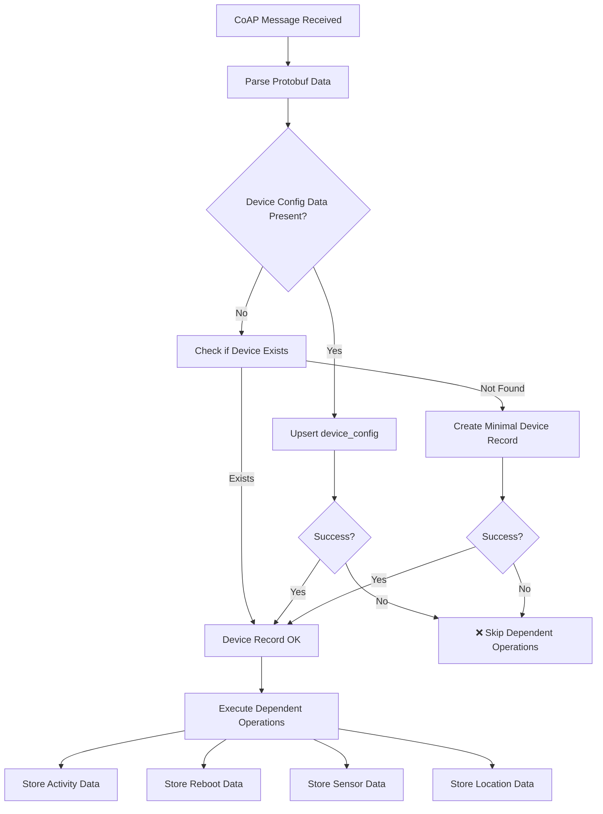
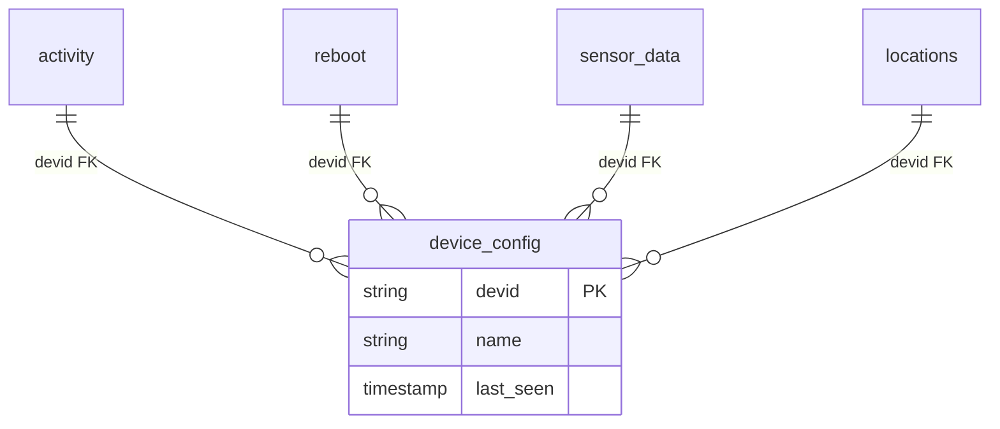

# Database Troubleshooting

Guide for debugging database storage issues when data from IoT devices isn't persisting correctly.

**Last updated:** November 16, 2024

## Storage Architecture

The database storage system handles foreign key dependencies and prevents cascade failures:



**Key Features:**
- **Foreign Key Management**: Ensures `device_config` exists before dependent operations
- **Individual Task Isolation**: One failed operation doesn't affect others
- **Automatic Device Creation**: Creates minimal device records when needed

## Database Schema Dependencies



**Critical Rule**: All tables except `device_config` require a valid device record to exist first.

## Debugging Workflow

### 1. Check Fly.io Server Logs

```bash
# View recent errors
flyctl logs --app flyio-nbiot | grep -E "(❌|⚠️|ERROR)"

# Check device-specific operations
flyctl logs --app flyio-nbiot | grep "device_id_here"

# Monitor database operations
flyctl logs --app flyio-nbiot | grep "database"
```

### 2. Verify Database Connectivity

```bash
# Test Supabase connectivity
curl -H "apikey: your-service-key" \
     -H "Authorization: Bearer your-service-key" \
     "https://cdwtsrzshpotkfbyyyjk.supabase.co/rest/v1/device_config?select=devid&limit=1"
```

### 3. Check Device Records

```sql
-- Verify device exists
SELECT devid, created_at, last_seen
FROM device_config
WHERE devid = 'your-device-id';

-- Check recent activity
SELECT COUNT(*) FROM activity WHERE devid = 'your-device-id';
SELECT COUNT(*) FROM sensor_data WHERE devid = 'your-device-id';
SELECT COUNT(*) FROM reboot WHERE devid = 'your-device-id';
```

## Common Issues

### Issue: Data Not Storing

**Symptoms:**
- Fly.io logs show messages received
- No data appearing in database tables

**Debugging:**

1. **Check environment variables:**
   ```bash
   flyctl config show --app flyio-nbiot | grep SUPABASE
   ```

2. **Test database connection from Fly.io:**
   ```bash
   flyctl ssh console --app flyio-nbiot
   curl -H "apikey: $SUPABASE_API_KEY" "$SUPABASE_URL/rest/v1/"
   ```

3. **Verify Supabase service status:**
   ```bash
   curl "https://cdwtsrzshpotkfbyyyjk.supabase.co/rest/v1/"
   ```

**Solutions:**
- Regenerate Supabase service keys
- Update Fly.io environment variables
- Check Supabase project isn't paused

### Issue: Foreign Key Violations

**Symptoms:**
- Error messages mentioning "foreign key constraint"
- Activity/reboot/sensor_data operations failing
- Device_config operations appear successful

**Debugging:**

```bash
# Check for foreign key errors in logs
flyctl logs --app flyio-nbiot | grep -i "foreign key"

# Verify device ID consistency
flyctl logs --app flyio-nbiot | grep "device.*id"
```

**Solutions:**
- Ensure device ID extraction uses consistent formatting
- Add device ID validation before database operations
- Check for special characters or encoding issues

### Issue: Partial Storage Success

**Symptoms:**
- Some data types storing, others failing
- Inconsistent success rates

**Debugging:**

```bash
# Monitor which operations fail
flyctl logs --app flyio-nbiot | grep "operation.*failed"

# Check for timeout patterns
flyctl logs --app flyio-nbiot | grep -i timeout
```

**Solutions:**
- Increase HTTP timeout values in `store_to_supabase.py`
- Verify Row Level Security policies allow inserts
- Check table-specific permissions

## Performance Monitoring

### Storage Operation Metrics

```sql
-- Most active devices by storage volume
SELECT
  devid,
  COUNT(*) as total_records,
  MAX(created_at) as last_activity
FROM (
  SELECT devid, created_at FROM activity
  UNION ALL
  SELECT devid, created_at FROM reboot
  UNION ALL
  SELECT devid, created_at FROM sensor_data
) combined
WHERE created_at > NOW() - INTERVAL '7 days'
GROUP BY devid
ORDER BY total_records DESC
LIMIT 10;

-- Recent storage activity
SELECT
  date_trunc('hour', created_at) as hour,
  COUNT(*) as operations
FROM activity
WHERE created_at > NOW() - INTERVAL '24 hours'
GROUP BY hour
ORDER BY hour DESC;
```

### Database Health Check

```sql
-- Verify all IoT tables exist
SELECT table_name
FROM information_schema.tables
WHERE table_name IN ('device_config', 'activity', 'reboot', 'sensor_data', 'locations')
ORDER BY table_name;

-- Check foreign key constraints
SELECT
  tc.table_name,
  kcu.column_name,
  ccu.table_name AS foreign_table_name
FROM information_schema.table_constraints AS tc
JOIN information_schema.key_column_usage AS kcu ON tc.constraint_name = kcu.constraint_name
JOIN information_schema.constraint_column_usage AS ccu ON ccu.constraint_name = tc.constraint_name
WHERE constraint_type = 'FOREIGN KEY'
  AND tc.table_name IN ('activity', 'reboot', 'sensor_data', 'locations');
```

## Row Level Security (RLS) Debugging

```sql
-- Check RLS policies on critical tables
SELECT tablename, policyname, cmd, qual
FROM pg_policies
WHERE tablename IN ('device_config', 'activity', 'reboot', 'sensor_data')
ORDER BY tablename, policyname;

-- Test RLS bypass with service role
SET ROLE service_role;
INSERT INTO device_config (devid) VALUES ('rls-test-device');
SELECT * FROM device_config WHERE devid = 'rls-test-device';
DELETE FROM device_config WHERE devid = 'rls-test-device';
```
