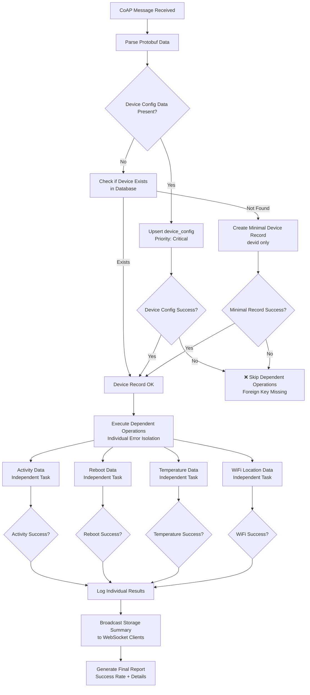
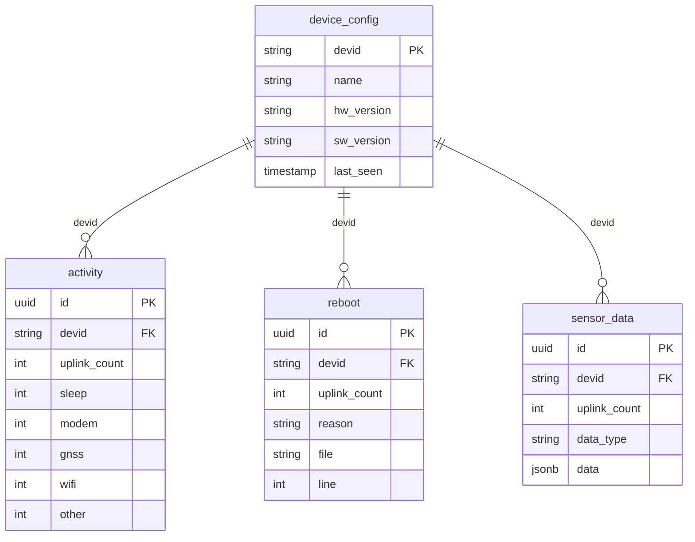

# Database Storage Troubleshooting

This guide covers debugging and troubleshooting the enhanced database storage system that ensures reliable data persistence from IoT devices.

## Enhanced Storage Architecture (v2.0)

The database storage system has been redesigned to handle foreign key dependencies and prevent cascade failures:



### Key Improvements

1. **Foreign Key Dependency Management**: Ensures `device_config` exists before dependent operations
2. **Individual Task Isolation**: One failed operation doesn't affect others
3. **Detailed Error Reporting**: Specific failure reasons for each operation
4. **Automatic Device Creation**: Creates minimal device records when needed
5. **Real-time Storage Feedback**: Live logs show database operation status

## Database Schema Dependencies

Understanding the dependency chain is crucial for debugging:



**Critical Rule**: All tables except `device_config` require a valid device record to exist first.

## Debugging Database Issues

### 1. Check Storage Status in Live Logs

When using the DeviceLogViewer, look for database storage status messages:

```javascript
// Good storage (all operations successful):
"Database storage: 4/4 operations successful"

// Partial failures:
"Database storage: 3/4 operations successful"  

// Complete failure:
"Database storage: 0/4 operations successful"
```

### 2. Analyze Storage Details

Storage status messages include detailed operation results:

```json
{
  "type": "system",
  "message": "Database storage: 3/4 operations successful",
  "details": {
    "storage_success": true,
    "success_rate": 75.0,
    "operations": {
      "activity": {"success": true, "error": null},
      "temperature": {"success": true, "error": null}, 
      "wifi": {"success": true, "error": null},
      "reboot": {"success": false, "error": "Foreign key constraint violation"}
    }
  }
}
```

### 3. Server-Side Log Analysis

Check Fly.io server logs for detailed error information:

```bash
# Filter for database-related errors
flyctl logs --app flyio-nbiot | grep -E "(❌|⚠️|📊)"

# Look for specific patterns:
# "✅ Device config updated for ABC123"
# "❌ Critical: device_config upsert failed for ABC123"  
# "📊 3/4 operations completed for ABC123 (75.0%)"
```

### 4. Database Connectivity Testing

Test direct database connectivity:

```bash
# Test basic Supabase connectivity
curl -H "apikey: your-service-key" \
     -H "Authorization: Bearer your-service-key" \
     "https://cdwtsrzshpotkfbyyyjk.supabase.co/rest/v1/device_config?select=devid&limit=1"

# Expected response:
[{"devid": "some-device-id"}]
```

## Common Issues and Solutions

### Issue: "Only temperature data being stored"

**Symptoms:**
- Live logs show partial storage success
- Only `sensor_data` table has new temperature records
- `activity`, `reboot` tables remain empty

**Root Cause:**
Foreign key constraint failures due to missing or failed `device_config` operations.

**Debugging Steps:**

1. **Check device record exists:**
   ```sql
   SELECT devid, created_at, last_seen 
   FROM device_config 
   WHERE devid = 'your-device-id';
   ```

2. **Look for device_config failures in logs:**
   ```bash
   flyctl logs --app flyio-nbiot | grep "device_config.*failed"
   ```

3. **Check for Row Level Security (RLS) issues:**
   ```sql
   -- Test with service key (bypasses RLS)
   SET ROLE service_role;
   INSERT INTO device_config (devid) VALUES ('test-device-123');
   ```

**Solutions:**
- Verify SUPABASE_API_KEY has service role permissions
- Check device_config table RLS policies allow inserts
- Ensure device ID format matches schema constraints

### Issue: "Cascade failures - nothing storing"

**Symptoms:**
- Storage status shows "0/X operations successful"
- All database operations failing simultaneously
- Live logs work but no database updates

**Root Cause:**
Fundamental database connectivity or authentication issues.

**Debugging Steps:**

1. **Verify environment variables on Fly.io:**
   ```bash
   flyctl config show --app flyio-nbiot | grep SUPABASE
   ```

2. **Test database connectivity from Fly.io:**
   ```bash
   flyctl ssh console --app flyio-nbiot
   # Inside Fly.io container:
   curl -H "apikey: $SUPABASE_API_KEY" "$SUPABASE_URL/rest/v1/"
   ```

3. **Check Supabase service status:**
   ```bash
   curl "https://cdwtsrzshpotkfbyyyjk.supabase.co/rest/v1/health"
   ```

**Solutions:**
- Regenerate Supabase service keys
- Update Fly.io environment variables
- Check Supabase project billing/limits
- Verify database hasn't been paused

### Issue: "Inconsistent storage success rates"

**Symptoms:**
- Storage success varies: sometimes 4/4, sometimes 2/4
- No clear pattern to failures
- Some data types consistently fail

**Root Cause:**
Intermittent connectivity issues or race conditions.

**Debugging Steps:**

1. **Monitor success rates over time:**
   ```bash
   flyctl logs --app flyio-nbiot | grep "operations completed" | tail -20
   ```

2. **Check for timeout patterns:**
   ```bash
   flyctl logs --app flyio-nbiot | grep -i timeout
   ```

3. **Analyze which operations fail most:**
   ```bash
   flyctl logs --app flyio-nbiot | grep "operation returned False"
   ```

**Solutions:**
- Increase HTTP timeout values in `store_to_supabase.py`
- Implement retry logic for failed operations
- Consider database connection pooling

### Issue: "Foreign key constraint violations"

**Symptoms:**
- Error messages mentioning "foreign key constraint"
- Activity/reboot/sensor_data operations failing
- Device_config operations appear successful

**Root Cause:**
Race conditions or inconsistent device ID handling.

**Debugging Steps:**

1. **Verify device ID consistency:**
   ```python
   # In main.py, add logging for device ID extraction:
   logger.info(f"Extracted device ID: '{dev_id}' (type: {type(dev_id)})")
   ```

2. **Check for special characters or encoding issues:**
   ```sql
   SELECT devid, length(devid), ascii(devid) 
   FROM device_config 
   WHERE devid LIKE '%problematic-pattern%';
   ```

3. **Look for transaction isolation issues:**
   ```bash
   flyctl logs --app flyio-nbiot | grep -A5 -B5 "foreign key"
   ```

**Solutions:**
- Ensure device ID extraction uses consistent string formatting
- Add device ID validation before database operations
- Consider using database transactions for atomic operations

## Performance Monitoring

### Storage Operation Metrics

Monitor database performance with these queries:

```sql
-- Average storage operation timing
SELECT 
  created_at::date,
  COUNT(*) as operations,
  AVG(EXTRACT(epoch FROM (created_at - lag(created_at) OVER (ORDER BY created_at)))) as avg_gap_seconds
FROM activity 
WHERE created_at > NOW() - INTERVAL '24 hours'
GROUP BY created_at::date
ORDER BY created_at::date DESC;

-- Most active devices by storage volume  
SELECT 
  devid,
  COUNT(*) as total_records,
  MAX(created_at) as last_activity
FROM (
  SELECT devid, created_at FROM activity
  UNION ALL
  SELECT devid, created_at FROM reboot  
  UNION ALL
  SELECT devid, created_at FROM sensor_data
) combined
WHERE created_at > NOW() - INTERVAL '7 days'
GROUP BY devid
ORDER BY total_records DESC
LIMIT 10;

-- Storage operation success rate tracking
SELECT 
  date_trunc('hour', created_at) as hour,
  COUNT(*) as successful_operations
FROM activity
WHERE created_at > NOW() - INTERVAL '24 hours'  
GROUP BY hour
ORDER BY hour DESC;
```

### Error Rate Analysis

```bash
# Calculate error rates from Fly.io logs
flyctl logs --app flyio-nbiot --since 1h | \
grep -E "(operations completed|storage.*successful)" | \
awk '{
  if ($0 ~ /([0-9]+)\/([0-9]+) operations completed/) {
    match($0, /([0-9]+)\/([0-9]+)/, arr)
    success += arr[1]; total += arr[2]
  }
} 
END { print "Success rate:", (success/total)*100"%" }'
```

## Database Schema Validation

### Verify Table Structure

```sql
-- Check all IoT-related tables exist
SELECT table_name, table_type 
FROM information_schema.tables 
WHERE table_name IN ('device_config', 'activity', 'reboot', 'sensor_data')
ORDER BY table_name;

-- Verify foreign key constraints
SELECT 
  tc.table_name, 
  kcu.column_name, 
  ccu.table_name AS foreign_table_name,
  ccu.column_name AS foreign_column_name 
FROM information_schema.table_constraints AS tc 
JOIN information_schema.key_column_usage AS kcu ON tc.constraint_name = kcu.constraint_name
JOIN information_schema.constraint_column_usage AS ccu ON ccu.constraint_name = tc.constraint_name
WHERE constraint_type = 'FOREIGN KEY' 
  AND tc.table_name IN ('activity', 'reboot', 'sensor_data');
```

### Row Level Security (RLS) Debugging

```sql
-- Check RLS policies on critical tables
SELECT schemaname, tablename, policyname, permissive, roles, cmd, qual
FROM pg_policies  
WHERE tablename IN ('device_config', 'activity', 'reboot', 'sensor_data')
ORDER BY tablename, policyname;

-- Test RLS bypass with service role
SET ROLE service_role;
INSERT INTO device_config (devid) VALUES ('rls-test-device');
SELECT * FROM device_config WHERE devid = 'rls-test-device';
DELETE FROM device_config WHERE devid = 'rls-test-device';
```

## Advanced Debugging Techniques

### Custom Logging for Database Operations

Add this to `store_to_supabase.py` for detailed debugging:

```python
async def debug_database_operation(operation_name: str, devid: str, operation_func):
    """Enhanced logging wrapper for database operations"""
    start_time = time.time()
    
    try:
        logger.debug(f"🔍 Starting {operation_name} for {devid}")
        result = await operation_func()
        
        duration = (time.time() - start_time) * 1000  # ms
        status = "✅" if result else "⚠️"
        logger.info(f"{status} {operation_name} for {devid}: {duration:.1f}ms")
        
        return result
        
    except Exception as e:
        duration = (time.time() - start_time) * 1000  # ms
        logger.error(f"❌ {operation_name} failed for {devid} after {duration:.1f}ms: {e}")
        return False
```

### Database Connection Pool Monitoring

Monitor connection usage patterns:

```python
# Add to SupabaseClient class
import asyncio

class SupabaseClient:
    def __init__(self):
        # ... existing code ...
        self._active_connections = 0
        self._max_concurrent = 0
    
    async def _track_connection(self, session, operation):
        self._active_connections += 1
        self._max_concurrent = max(self._max_concurrent, self._active_connections)
        
        try:
            result = await operation(session)
            return result
        finally:
            self._active_connections -= 1
            
            if self._active_connections == 0:
                logger.debug(f"📊 Peak concurrent connections: {self._max_concurrent}")
                self._max_concurrent = 0
```

This database troubleshooting guide should help you identify and resolve data storage issues quickly. The enhanced error handling and reporting system provides much better visibility into what's happening at each stage of the storage process.