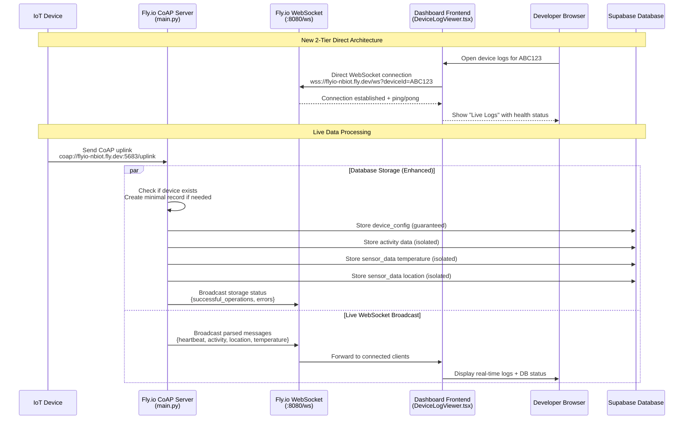
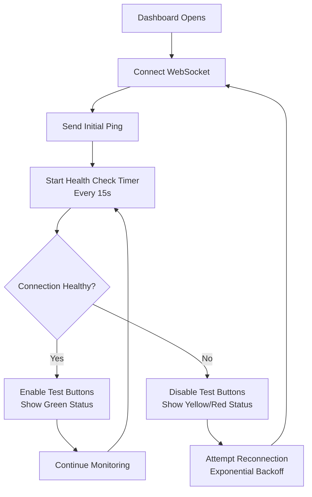

# WebSocket Live Logs Debugging

This guide provides practical debugging information for the WebSocket-based live logging system that streams real-time device messages to the dashboard.

## New Architecture (2024 v2.0)

The system has been redesigned to use a **simplified 2-tier direct architecture** for better reliability and easier debugging:



### Key Improvements

- **Eliminated Supabase relay** - Dashboard connects directly to Fly.io
- **Enhanced database error handling** - Individual operation isolation prevents cascade failures
- **Connection health monitoring** - Ping/pong system with metrics
- **Exponential backoff reconnection** - Smart retry logic with increasing delays
- **Real-time storage feedback** - See database operation results in live logs

## Connection Architecture Details

### Direct WebSocket Connection
```typescript
// Dashboard connects directly to Fly.io (no intermediary)
const wsUrl = `wss://flyio-nbiot.fly.dev/ws?deviceId=${encodeURIComponent(deviceId)}`;
websocketRef.current = new WebSocket(wsUrl);
```

### Connection Health System


## Debugging Workflow

### 1. Check Connection Status

#### Frontend Debug Console
```javascript
// Open DevTools Console in dashboard, look for:

// Good connection:
"✅ Connected to device logs for ABC123"
"✅ WebSocket connection healthy - received pong"

// Connection issues:
"❌ WebSocket error: [object Event]"
"⚠️ Attempting to reconnect in 2000ms..."
```

#### Live Logs UI Indicators
- **Green pulsing dot**: Healthy connection with server response
- **Yellow dot**: Connected but server health check failed
- **Red dot**: Disconnected, attempting reconnection

### 2. Verify Fly.io Server Health

#### Health Check Endpoint
```bash
# Basic health check
curl "https://flyio-nbiot.fly.dev/health"

# Detailed diagnostics (shows all active WebSocket connections)
curl "https://flyio-nbiot.fly.dev/health?detailed=true"
```

#### Expected Response
```json
{
  "status": "healthy",
  "timestamp": "2024-01-15T10:30:00.000Z",
  "server_info": {
    "version": "1.0",
    "live_logs_token_configured": true
  },
  "websocket_connections": {
    "total_connections": 3,
    "active_devices": 2,
    "device_connections": {
      "ABC123": 1,
      "XYZ789": 2
    }
  },
  "database_config": {
    "supabase_url_configured": true,
    "supabase_api_key_configured": true
  }
}
```

### 3. Monitor Connection in Real-Time

#### WebSocket Message Flow
```bash
# Use browser DevTools Network tab:
# 1. Open DeviceLogViewer for a device
# 2. Go to Network tab, filter by "WS"
# 3. Click on the WebSocket connection
# 4. View Messages tab to see live traffic

# Expected message types:
{
  "type": "system",           // Connection status
  "type": "pong",            // Health check responses  
  "type": "heartbeat",       // Device config data
  "type": "activity",        // Power consumption data
  "type": "temperature",     // Temperature readings
  "type": "location",        // WiFi scan data
  "type": "coap"            // Raw CoAP messages
}
```

## Test Button Diagnostics

### Smart Button State Logic
```mermaid
flowchart TD
    A[User Clicks Test Button] --> B{WebSocket Connected?}
    B -->|No| C[Button Disabled<br/>Show "Not Connected"]
    B -->|Yes| D{Server Health Check OK?}
    D -->|No| E[Button Disabled<br/>Show "Server Unhealthy"]  
    D -->|Yes| F[Button Enabled<br/>Show "Sending..."]
    F --> G[Send HTTP Request to /test]
    G --> H{HTTP Response OK?}
    H -->|Yes| I[✅ Add Success Message to Live Log]
    H -->|No| J[❌ Add Error Message to Live Log]
    I --> K[Reset Button State]
    J --> K
```

### Test Button Debugging
```bash
# Manual test button simulation:
curl "https://flyio-nbiot.fly.dev/test?deviceId=ABC123&type=heartbeat&count=1"

# Expected response:
"Generated 1 test messages for ABC123"

# Check if messages appear in WebSocket:
# - Should see HTTP success in logs
# - Should see actual test messages in live logs within 1-2 seconds
```

## Common Issues and Solutions

### Issue: "Connected" but No Messages

**Symptoms:**
- WebSocket shows green "Connected" status  
- Test buttons work (HTTP requests succeed)
- No live messages appear when test buttons clicked

**Debugging:**
```bash
# 1. Check server WebSocket broadcast system
curl "https://flyio-nbiot.fly.dev/health?detailed=true" | jq '.websocket_connections'

# 2. Verify device ID is correct
# - Check Dashboard URL has correct deviceId parameter
# - Confirm test messages use same deviceId

# 3. Check Fly.io logs for broadcast errors
flyctl logs --app flyio-nbiot | grep "WS send failed"
```

**Solutions:**
- Refresh the page to reset WebSocket connection
- Verify deviceId matches exactly (case-sensitive)
- Check for Fly.io server connection cleanup issues

### Issue: Frequent Disconnections

**Symptoms:**
- Connection drops every few minutes
- Constant reconnection attempts
- Yellow/red status indicators

**Debugging:**
```javascript
// Check reconnection attempt pattern in console:
// Normal: "Attempting to reconnect in 1000ms..."
//         "Attempting to reconnect in 2000ms..."
// Problem: Same delay repeating (no exponential backoff)

// Check connection metadata:
websocketRef.current?.readyState  // Should be 1 (OPEN)
```

**Solutions:**
- Check network stability (corporate firewalls, VPNs)
- Verify Fly.io service health: `flyctl status --app flyio-nbiot`
- Look for memory leaks causing server restarts

### Issue: Database Storage Failing

**Symptoms:**
- Live logs working fine
- Real-time database updates not appearing
- Storage status messages show failures

**Debugging:**
1. **Check live log storage status messages:**
   ```
   Look for: "Database storage: 3/4 operations successful"
   ```

2. **Check Fly.io server logs:**
   ```bash
   flyctl logs --app flyio-nbiot | grep "❌\|⚠️"
   ```

3. **Test database connectivity:**
   ```bash
   # Check if Supabase is accessible from Fly.io
   curl -H "apikey: your-key" "https://cdwtsrzshpotkfbyyyjk.supabase.co/rest/v1/device_config?select=devid&limit=1"
   ```

**Solutions:**
- Verify SUPABASE_URL and SUPABASE_API_KEY environment variables
- Check device_config table exists (foreign key dependency)
- Review database table permissions and RLS policies

### Issue: Test Buttons Always Disabled

**Symptoms:**
- WebSocket appears connected
- Test buttons remain grayed out
- Status shows "Connected" but health check fails

**Debugging:**
```bash
# Check health endpoint response time
time curl "https://flyio-nbiot.fly.dev/health"

# Verify server is responding to health checks
curl -w "%{http_code}" "https://flyio-nbiot.fly.dev/health"
```

**Solutions:**
- Clear browser cache and cookies
- Check if multiple DeviceLogViewer windows are open
- Restart the Fly.io app: `flyctl restart --app flyio-nbiot`

## Performance Monitoring

### Connection Metrics
- **Typical Connection Time**: < 500ms
- **Ping/Pong Latency**: < 200ms  
- **Message Delivery**: < 100ms from server broadcast
- **Health Check Interval**: 15 seconds

### Memory Usage
```bash
# Monitor WebSocket connections on Fly.io
flyctl status --app flyio-nbiot

# Check memory usage patterns
flyctl logs --app flyio-nbiot | grep "memory"
```

### Database Performance
```sql
-- Monitor slow queries in Supabase
SELECT query, mean_time, calls 
FROM pg_stat_statements 
WHERE query LIKE '%device_config%' 
ORDER BY mean_time DESC 
LIMIT 10;
```

## Advanced Debugging

### WebSocket Frame Analysis
Use browser DevTools to analyze WebSocket frames:
1. Open DeviceLogViewer
2. F12 → Network → WebSocket connection
3. Check frame sizes, frequency, and content

### Server-Side Connection Tracking
```python
# Add to Fly.io main.py for detailed connection logging:
logger.info(f"WS connected: deviceId={device_id}, total={len(ws_clients[device_id])}")
logger.info(f"WS disconnected: deviceId={device_id}, remaining={len(ws_clients[device_id])}")
```

### Message Tracing
Enable message tracing by adding device-specific logging:
```python
# In ws_broadcast function
if device_id == "DEBUG_DEVICE_ID":
    logger.debug(f"Broadcasting to {device_id}: {json.dumps(payload)}")
```

This debugging guide should help you quickly identify and resolve WebSocket live logging issues. The new 2-tier architecture significantly reduces complexity and failure points compared to the previous 3-tier relay system.